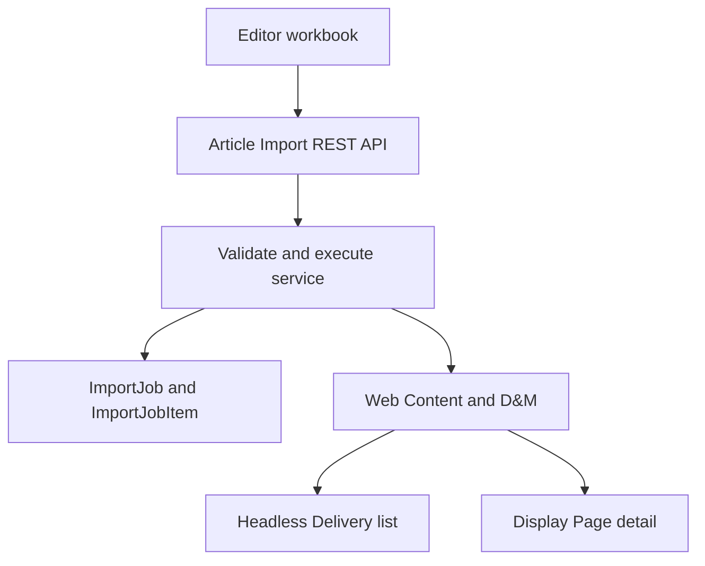
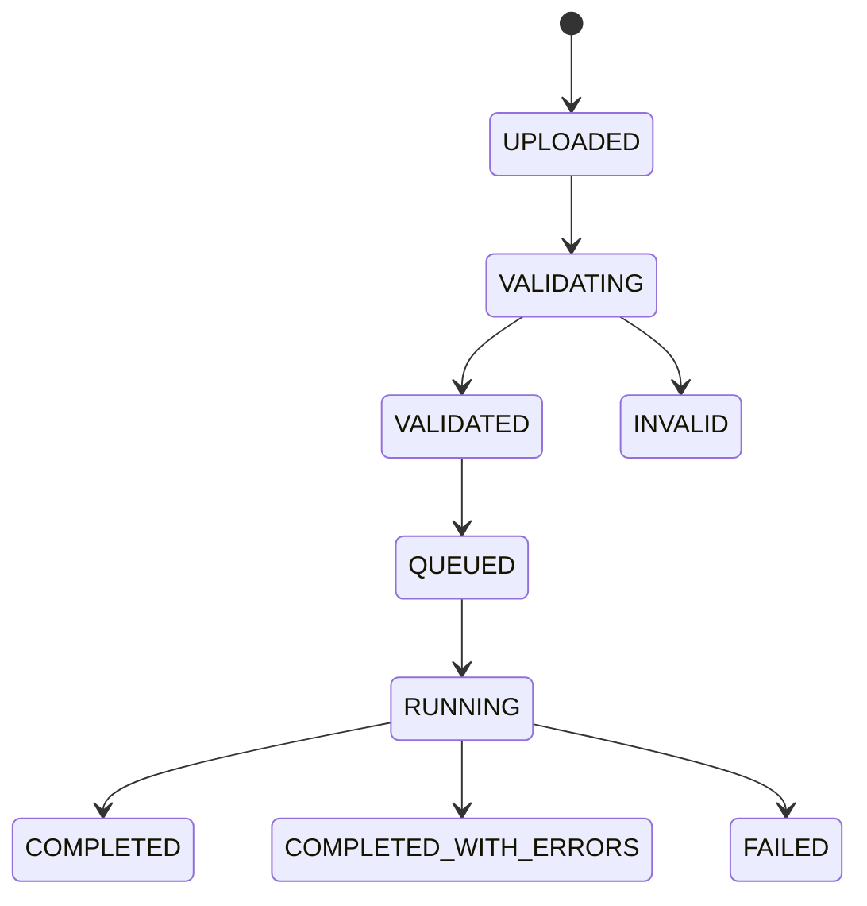

# Article Content Pipeline — Solution and Detailed Design

Status: **DESIGN READY / IMPLEMENTATION AND RUNTIME QA PENDING**  
Target: **Liferay DXP 2026.Q1.1**  
Decision owner: Nexcent training project

## 1. Decision

Use classic Liferay Web Content (`StructuredContent`) as the Article source of truth for the 2026.Q1.1 baseline.

- Web Content owns editorial data, localization, versions, workflow, permissions, taxonomy, friendly URLs, and display pages.
- Documents and Media owns cover images. Articles reference files by external reference code (ERC).
- A server-side Excel importer validates and upserts Articles by ERC.
- Service Builder stores only import operations and row results. It does not duplicate Article content.
- REST Builder exposes the upload, validate, execute, and status workflow.
- The Article list consumes the standard Headless Delivery API.
- Article detail is rendered by a Display Page Template at `/w/{friendlyUrlPath}`.

Liferay's newer object-based Headless CMS is an optional evaluation lab, not the course baseline. In 2026.Q1 it requires release feature flags and has version-sensitive behavior, so adopting it here would make the lab less repeatable.

## 2. Architecture



The REST resource is an adapter. Parsing, validation, and import orchestration live in a dedicated OSGi service so that REST, scheduled jobs, and future UI clients can reuse the same logic.

## 3. Content model

### 3.1 Structure identity

| Property | Value |
|---|---|
| Name | `NXC Article` |
| Structure key | `NXC_ARTICLE` |
| External reference code | `NXC-STRUCTURE-ARTICLE` |
| Default locale | `en-US` |
| Detail template | `NXC Article Detail` |

Do not create custom fields for values already owned by Liferay, including title, ERC, friendly URL, publish/expiration dates, categories, tags, workflow status, or version.

### 3.2 Custom fields

| Label | Field reference | Type | Required | Rules |
|---|---|---|---:|---|
| Summary | `summary` | Long Text | Yes | Plain text, 40–320 characters |
| Body | `body` | Rich Text | Yes | Sanitized HTML; no script, iframe, inline event, or JavaScript URL |
| Cover Image | `coverImage` | Image | Yes | Resolve a Documents and Media file by ERC |
| Cover Image Alt | `coverImageAlt` | Text | Yes | Meaningful text, max 180 characters |
| Author Name | `authorName` | Text | Yes | Display label, max 120 characters |
| Featured | `featured` | Boolean | Yes | Defaults to `false` |
| Sort Order | `sortOrder` | Integer | Yes | `0..999999`; gaps of 10 recommended |

The structure JSON exported from the target runtime is the deployable schema artifact. Numeric structure IDs are runtime values and must never be copied into frontend configuration.

### 3.3 Taxonomy

| Item | ERC |
|---|---|
| Vocabulary `NXC Article Topics` | `NXC-VOCABULARY-ARTICLE-TOPICS` |
| Membership | `NXC-TOPIC-MEMBERSHIP` |
| Safeguarding | `NXC-TOPIC-SAFEGUARDING` |
| Community | `NXC-TOPIC-COMMUNITY` |
| Technology | `NXC-TOPIC-TECHNOLOGY` |

Categories are controlled classification; tags are free-form discovery metadata. Import validation rejects unknown category ERCs but may create missing tags when the caller has permission.

## 4. Excel contract

Workbook: `nxc-article-import-template.xlsx`

### 4.1 Sheets

| Sheet | Purpose |
|---|---|
| `Articles` | Import payload; one localized Article per row |
| `Taxonomy` | Allowed category ERC reference |
| `Instructions` | Authoring, validation, and workflow rules |

Only `Articles` is executable input. The other sheets are documentation and lookup references.

### 4.2 Article columns

| Column | Required | Contract |
|---|---:|---|
| `operation` | Yes | `UPSERT` or `ARCHIVE` |
| `externalReferenceCode` | Yes | Immutable, unique in the site, `NXC-ARTICLE-*` |
| `locale` | Yes | Enabled site locale; baseline `en-US` or `vi-VN` |
| `title` | Yes | 1–255 characters |
| `friendlyUrlPath` | Yes | Lowercase path segment, unique per locale |
| `summary` | Yes | Plain text, 40–320 characters |
| `bodyHtml` | Yes for UPSERT | Sanitized rich text |
| `coverImageERC` | Yes for UPSERT | Existing D&M file ERC |
| `coverImageAlt` | Yes for UPSERT | Non-empty accessible description |
| `authorName` | Yes for UPSERT | Display author |
| `publicationDate` | Yes for UPSERT | Excel Date/Time or ISO-8601; normalized to UTC |
| `expirationDate` | No | Empty or later than publication date |
| `categoryERCs` | No | Semicolon-separated category ERCs |
| `tags` | No | Semicolon-separated tag names |
| `featured` | Yes for UPSERT | Boolean |
| `sortOrder` | Yes for UPSERT | Integer `0..999999` |
| `publish` | No | Defaults to `false`; Draft is the safe default |

Localized rows reuse the same Article ERC. The first row for an ERC must use the site's default locale; later locale rows update translations on the same Web Content item.

### 4.3 File constraints

- Accept only `.xlsx`; reject legacy `.xls`, CSV disguised as XLSX, macros, external links, formulas, and encrypted files.
- Maximum file size: 10 MiB.
- Maximum data rows: 5,000.
- Read cell values with Apache POI's `DataFormatter`; do not execute formulas.
- Store SHA-256 for audit and duplicate-upload detection.
- Stream the upload to Documents and Media; do not hold the entire workbook in heap.

## 5. Import workflow



### 5.1 Upload

1. Require `UPDATE` permission for site content and `ADD_DOCUMENT` for the import folder.
2. Validate extension, MIME signature, size, and filename.
3. Save the original workbook in a restricted D&M folder.
4. Create or reset one `ImportJob` using `(groupId, jobKey)` as the idempotency key.
5. Return `202 Accepted` with status `UPLOADED`.

### 5.2 Validate

Validation is read-only with respect to Articles.

1. Parse the exact headers and reject missing, duplicate, or unknown required columns.
2. Normalize whitespace, booleans, integer values, timestamps, slug, categories, and tags.
3. Validate duplicate `(ERC, locale)` and duplicate `(friendlyUrlPath, locale)` values inside the workbook.
4. Resolve the Article structure by ERC.
5. Resolve each cover image and category by ERC.
6. Check target-site locales and caller permissions.
7. Sanitize HTML and report rejected markup.
8. Compare each normalized row with existing Web Content and classify it as `CREATE`, `UPDATE`, `NO_CHANGE`, or `ARCHIVE`.
9. Persist one `ImportJobItem` per row and aggregate counts.
10. Transition to `VALIDATED` only when no error exists; warnings do not block execution.

### 5.3 Execute

Execution is allowed only from `VALIDATED` and uses the persisted normalized validation result.

- Process in bounded chunks of 100 rows.
- Use a new transaction per row or small chunk; one bad row must not roll back the whole workbook.
- UPSERT by Article ERC, then apply the locale translation, taxonomy, dates, and D&M reference.
- Create a new Web Content version only when the normalized row changes content.
- `publish=false` saves Draft or starts configured workflow; `publish=true` requires explicit Publish permission.
- `ARCHIVE` expires the Article and preserves history; it never hard-deletes editorial content.
- Re-running the same validated workbook is idempotent and reports `NO_CHANGE` rows.
- Stop only on infrastructure or contract failure; row business errors produce `COMPLETED_WITH_ERRORS`.

## 6. Service Builder design

Service Builder is justified because import jobs require durable queryable operational state, row-level audit, and transactional orchestration. It is not justified for Article content itself.

### 6.1 `ImportJob`

| Column | Type | Purpose |
|---|---|---|
| `importJobId` | long PK | Internal identity |
| `uuid`, audit fields | standard | Liferay audit |
| `groupId` | long | Site scope |
| `jobKey` | String | Public import ERC/idempotency key |
| `fileEntryId` | long | Restricted original workbook |
| `fileName` | String | Original filename |
| `sha256` | String | Integrity and duplicate detection |
| `structureERC` | String | Expected structure contract |
| `status` | String | State machine value |
| `totalRows` | int | Parsed rows |
| `createdRows` | int | Created Articles |
| `updatedRows` | int | Updated Articles |
| `skippedRows` | int | No-change rows |
| `failedRows` | int | Error rows |
| `startedDate`, `completedDate` | Date | Execution timing |
| `errorMessage` | String | Job-level failure only |

Finders:

- unique `JK_G(jobKey, groupId)`;
- `G_S(groupId, status)`;
- ordered site history by `createDate` descending.

### 6.2 `ImportJobItem`

| Column | Type | Purpose |
|---|---|---|
| `importJobItemId` | long PK | Internal identity |
| `importJobId` | long | Parent job |
| `rowNumber` | int | Workbook row |
| `articleERC` | String | Target Article |
| `locale` | String | Translation |
| `operation` | String | UPSERT/ARCHIVE |
| `result` | String | CREATE/UPDATE/NO_CHANGE/ARCHIVE/ERROR |
| `severity` | String | INFO/WARNING/ERROR |
| `messageCode` | String | Stable client-readable code |
| `message` | String | Human-readable detail |
| `payloadHash` | String | Normalized-row idempotency |

Unique finder: `J_R(importJobId, rowNumber)`.

Generated Service Builder classes are regenerated from `service.xml`; generated base/persistence/model sources are never edited manually. Schema changes require a module upgrade step and a version bump.

## 7. REST Builder design

Base path: `/o/nexcent-training/v1.0`

| Method | Path | Result |
|---|---|---|
| `POST` | `/sites/{siteId}/article-import-jobs` | Multipart upload; returns `202` job |
| `POST` | `/sites/{siteId}/article-import-jobs/{jobERC}/validate` | Starts/synchronously performs validation |
| `POST` | `/sites/{siteId}/article-import-jobs/{jobERC}/execute` | Queues execution; returns `202` |
| `GET` | `/sites/{siteId}/article-import-jobs` | Paged site job history |
| `GET` | `/sites/{siteId}/article-import-jobs/{jobERC}` | Job counts and status |
| `GET` | `/sites/{siteId}/article-import-jobs/{jobERC}/items` | Paged row results |

Upload request fields:

- `file`: binary XLSX, required;
- `externalReferenceCode`: job ERC, required;
- `structureExternalReferenceCode`: defaults to `NXC-STRUCTURE-ARTICLE`.

Use standard Liferay pagination (`Page<T>`), problem responses, permissions, and OpenAPI generation. Return stable error codes such as `INVALID_HEADER`, `DUPLICATE_ERC_LOCALE`, `IMAGE_ERC_NOT_FOUND`, `CATEGORY_ERC_NOT_FOUND`, `UNSAFE_HTML`, and `INVALID_STATE`.

Do not implement parsing inside `ImportJobResourceImpl`. It invokes an `ArticleImportManager` OSGi service and maps models to DTOs.

## 8. Headless list delivery

The frontend resolves the structure once by stable ERC/key, caches the numeric ID for the page session, then queries its Structured Content collection.

```http
GET /o/headless-delivery/v1.0/sites/{siteId}/content-structures
GET /o/headless-delivery/v1.0/content-structures/{structureId}/structured-contents?flatten=true&page=1&pageSize=9&sort=datePublished:desc
```

The client maps fields by `name`, never by array position. It renders only approved/published content visible to the current user.

```ts
type ArticleCard = {
    externalReferenceCode: string;
    title: string;
    summary: string;
    coverImage: {alt: string; url: string};
    authorName: string;
    datePublished: string;
    featured: boolean;
    sortOrder: number;
    detailUrl: string;
};
```

`detailUrl` is derived from the API-friendly URL data or the canonical `/w/{friendlyUrlPath}` contract. The app must support loading, ready, empty, and error states; it must not inject mock business content on failure.

Filtering is restricted to properties marked `x-filterable` in the running instance's `/o/headless-delivery/v1.0/openapi.json`. Do not guess OData filters. If business filtering is not supported, use a Liferay Collection/Info Framework provider or a purpose-built read API rather than downloading every Article to filter in the browser.

## 9. Article detail

Create a Display Page Template named `NXC Article Detail` and associate it with `NXC Article`.

Map:

- display page title → Web Content title;
- hero image and alt → `coverImage`, `coverImageAlt`;
- summary → `summary`;
- author → `authorName`;
- publication metadata → system publish date;
- body → `body`;
- category chips → asset categories.

Set it as the default Display Page Template for the structure. Verify the canonical URL `/w/{friendlyUrlPath}` without creating one site page per Article. Configure SEO title, description, canonical link, Open Graph image, and social description from mapped content where the runtime UI supports them.

## 10. Security and operations

- Require authenticated import; never grant Guest import endpoints.
- Use Liferay permission checks at both REST and service layers.
- Store uploads in a non-public D&M folder and apply retention cleanup after the audit window.
- Sanitize Rich Text server-side even if the workbook UI validates it.
- Escape all row-level messages; never echo raw HTML into the importer UI.
- Emit structured logs with `jobERC`, site ID, row number, Article ERC, duration, and result; omit body HTML and credentials.
- Prevent concurrent execute calls with an atomic state transition or lock keyed by job ID.
- Apply rate, row, file-size, and execution-time limits.

## 11. Test and runtime QA

### Contract tests

- Structure field references and ERCs match this document.
- XLSX headers match exactly and workbook contains no formula errors.
- OpenAPI generates successfully.
- `buildService` and `buildREST` produce no uncommitted generated-source diff.

### Import tests

- create, update, translation, no-change, and archive;
- duplicate ERC/locale and slug;
- missing image/category ERC;
- unsafe HTML, formula, macro, oversize workbook, invalid timestamp;
- authorization and cross-site isolation;
- retry after partial failure and duplicate execute request.

### Page QA

At `1440px`, `768px`, and `375px` verify Article list loading/empty/error/ready states, long titles, missing images, keyboard focus, contrast, card wrapping, canonical detail navigation, and no horizontal overflow. Detail QA covers heading hierarchy, image alt, rich-text tables/links, SEO metadata, and return navigation.

No Article work is merged until the runtime import, list, and detail screenshots pass. This gate is independent of the existing Header/Footer screenshot gate.

## 12. Implementation order

1. Create/export Structure and taxonomy artifacts in the target runtime.
2. Pre-upload cover images with stable D&M ERCs.
3. Create and verify the Display Page Template manually.
4. Implement Service Builder job and row entities; regenerate and compile.
5. Implement `ArticleImportManager` with parser, validator, and executor tests.
6. Implement REST Builder contracts and resource adapters; regenerate and compile.
7. Import the sample workbook as Draft, review, then publish.
8. Wire the Article list to Headless Delivery and canonical detail URLs.
9. Run responsive and failure-state QA; capture screenshots before merge.

## 13. Official references

- [Web Content API](https://learn.liferay.com/w/dxp/integration/headless-apis/content-management-apis/web-content-apis/web-content-api-basics)
- [Web Content Structures and JSON import/export](https://learn.liferay.com/w/dxp/content-management-system/web-content/web-content-structures/web-content-structures-with-data-engine)
- [Display Page Templates](https://learn.liferay.com/w/dxp/sites/displaying-content/using-display-page-templates)
- [REST API filtering and OpenAPI](https://learn.liferay.com/w/dxp/integration/headless-apis/using-liferay-as-a-headless-platform/consuming-apis/consuming-rest-services)
- [REST Builder](https://learn.liferay.com/w/dxp/integration/rest-builder)
- [Service Builder](https://learn.liferay.com/w/dxp/development/traditional-java-based-development/data-frameworks/service-builder)
- [Batch Engine imports](https://learn.liferay.com/w/dxp/integration/headless-apis/using-liferay-as-a-headless-platform/consuming-apis/batch-engine-api-basics-importing-data)
- [Liferay Headless CMS](https://learn.liferay.com/w/dxp/content-management-system/liferay-headless-content-management-system)
