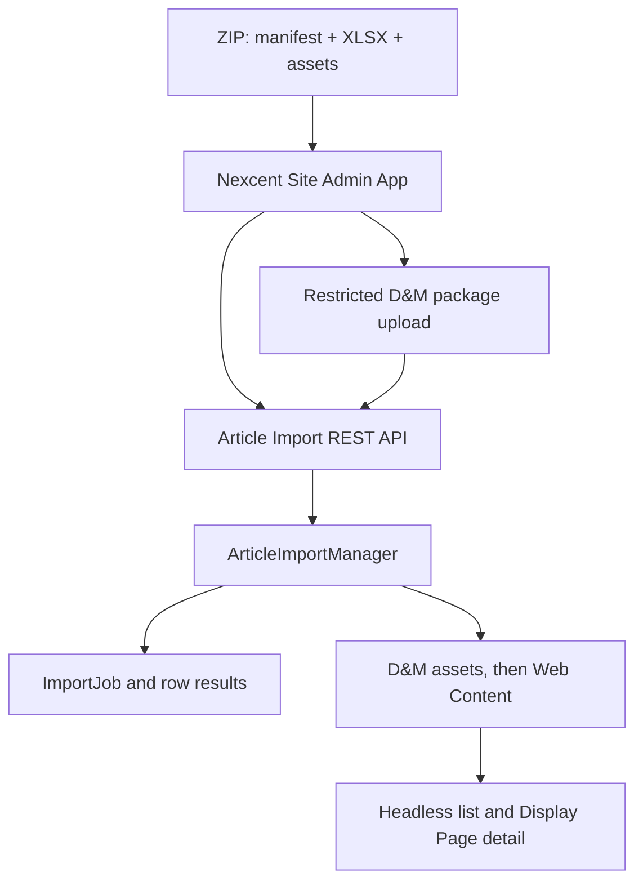
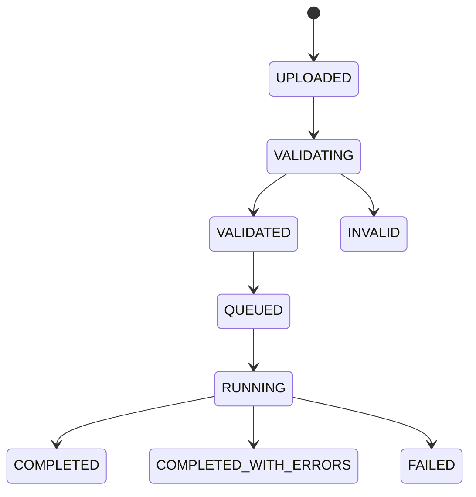

# Article Content Pipeline — Solution and Detailed Design

Status: **DESIGN READY / IMPLEMENTATION AND RUNTIME QA PENDING**  
Target: **Liferay DXP 2026.Q1.1**  
Decision owner: Nexcent training project

> **Implementation delta at this commit:** the branch already contains the Service Builder job/row foundation and a transitional REST endpoint that accepts multipart XLSX directly. It does not yet implement the ZIP package contract, media-first import, standard Documents API handoff, or `nexcent-training-web` Site Administration App defined below. Treat this document as the normative target; runtime verification remains pending.

## 1. Decision

Use classic Liferay Web Content (`StructuredContent`) as the Article source of truth for the 2026.Q1.1 baseline.

- Web Content owns editorial data, localization, versions, workflow, permissions, taxonomy, friendly URLs, and display pages.
- Documents and Media owns cover images. Articles reference files by stable external reference code (ERC), never by filename or numeric ID.
- Editors upload one portable ZIP package containing `manifest.json`, `articles.xlsx`, and an `assets/` directory.
- A Site Administration App appears under the current site's **Content & Data** menu; it is not placed on the public landing page and is not hosted as a separate external tool.
- The admin UI uploads the ZIP to a restricted Documents and Media import folder, then calls the Article import API with the resulting package `fileEntryId`.
- A server-side importer validates the package, upserts media first, and then upserts Articles by ERC.
- Service Builder stores only import operations and row results. It does not duplicate Article content.
- REST Builder exposes create-job, validate, execute, status, row-result, and retry orchestration endpoints. It does not parse Excel or write SQL.
- The Article list consumes the standard Headless Delivery API.
- Article detail is rendered by a Display Page Template at `/w/{friendlyUrlPath}`.

Liferay's newer object-based Headless CMS is an optional evaluation lab, not the course baseline. In 2026.Q1 it requires release feature flags and has version-sensitive behavior, so adopting it here would make the lab less repeatable.

## 2. Architecture



The REST resource is an adapter. ZIP inspection, Excel parsing, validation, media upsert, and Article orchestration live in a dedicated OSGi service so REST, scheduled jobs, and future clients can reuse the same logic. The React admin UI is delivered inside a Liferay MVC Portlet registered through `PanelApp`; the portlet is a native site-scoped administration shell, not the business layer.

## 3. Content model

### 3.1 Structure identity

| Property | Value |
|---|---|
| Name | `NXC Article` |
| Structure key | `NXC_ARTICLE` |
| External reference code | `NXC-STRUCTURE-ARTICLE` |
| Default locale | `en-US` |
| Detail template | `NXC Article Detail` |

Do not create custom fields for values already owned by Liferay, including title, ERC, friendly URL, publish/expiration dates, categories, tags, workflow status, or version.

### 3.2 Custom fields

| Label | Field reference | Type | Required | Rules |
|---|---|---|---:|---|
| Summary | `summary` | Long Text | Yes | Plain text, 40–320 characters |
| Body | `body` | Rich Text | Yes | Sanitized HTML; no script, iframe, inline event, or JavaScript URL |
| Cover Image | `coverImage` | Image | Yes | Resolve a Documents and Media file by ERC |
| Cover Image Alt | `coverImageAlt` | Text | Yes | Meaningful text, max 180 characters |
| Author Name | `authorName` | Text | Yes | Display label, max 120 characters |
| Featured | `featured` | Boolean | Yes | Defaults to `false` |
| Sort Order | `sortOrder` | Integer | Yes | `0..999999`; gaps of 10 recommended |

The structure JSON exported from the target runtime is the deployable schema artifact. Numeric structure IDs are runtime values and must never be copied into frontend configuration.

### 3.3 Taxonomy

| Item | ERC |
|---|---|
| Vocabulary `NXC Article Topics` | `NXC-VOCABULARY-ARTICLE-TOPICS` |
| Membership | `NXC-TOPIC-MEMBERSHIP` |
| Safeguarding | `NXC-TOPIC-SAFEGUARDING` |
| Community | `NXC-TOPIC-COMMUNITY` |
| Technology | `NXC-TOPIC-TECHNOLOGY` |

Categories are controlled classification; tags are free-form discovery metadata. Import validation rejects unknown category ERCs but may create missing tags when the caller has permission.

## 4. Import package contract

Package: `nexcent-article-import.zip`

### 4.1 Package layout

```text
nexcent-article-import.zip
├── manifest.json
├── articles.xlsx
└── assets/
    ├── community-management-cover.webp
    ├── membership-guide-cover.webp
    └── safeguarding-guide-cover.webp
```

The package is self-contained for repeatable import into a fresh environment. Never put Base64 images, absolute workstation paths, or Liferay numeric IDs in Excel.

### 4.2 Manifest

```json
{
  "schemaVersion": "1.0",
  "siteExternalReferenceCode": "NEXCENT-PUBLIC-WEBSITE",
  "structureExternalReferenceCode": "NXC-STRUCTURE-ARTICLE",
  "defaultLanguageId": "en_US",
  "mode": "UPSERT"
}
```

The backend validates the manifest against the current site and supported package schema before reading executable rows.

### 4.3 Workbook sheets

| Sheet | Purpose |
|---|---|
| `Articles` | Article payload; one localized Article per row |
| `Assets` | Stable image key → packaged file and D&M ERC mapping |
| `Taxonomy` | Allowed category ERC reference |
| `Instructions` | Authoring, validation, and workflow rules |

Only `Articles` and `Assets` are executable input. The other sheets are documentation and lookup references.

### 4.4 Article columns

| Column | Required | Contract |
|---|---:|---|
| `operation` | Yes | `UPSERT` or `ARCHIVE` |
| `externalReferenceCode` | Yes | Immutable, unique in the site, `NXC-ARTICLE-*` |
| `locale` | Yes | Enabled site locale; baseline `en-US` or `vi-VN` |
| `title` | Yes | 1–255 characters |
| `friendlyUrlPath` | Yes | Lowercase path segment, unique per locale |
| `summary` | Yes | Plain text, 40–320 characters |
| `bodyHtml` | Yes for UPSERT | Sanitized rich text |
| `coverImageKey` | Yes for UPSERT | Key from the `Assets` sheet |
| `coverImageAlt` | Yes for UPSERT | Non-empty accessible description |
| `authorName` | Yes for UPSERT | Display author |
| `publicationDate` | Yes for UPSERT | Excel Date/Time or ISO-8601; normalized to UTC |
| `expirationDate` | No | Empty or later than publication date |
| `categoryERCs` | No | Semicolon-separated category ERCs |
| `tags` | No | Semicolon-separated tag names |
| `featured` | Yes for UPSERT | Boolean |
| `sortOrder` | Yes for UPSERT | Integer `0..999999` |
| `publish` | No | Defaults to `false`; Draft is the safe default |

Localized rows reuse the same Article ERC. The first row for an ERC must use the site's default locale; later locale rows update translations on the same Web Content item.

### 4.5 Asset columns

| Column | Required | Contract |
|---|---:|---|
| `imageKey` | Yes | Unique workbook key referenced by Articles |
| `filePath` | Yes for packaged assets | Relative path below `assets/`; no `..`, absolute path, or symlink |
| `documentERC` | Yes | Stable target D&M ERC such as `NXC-DOC-ARTICLE-001` |
| `title` | Yes | D&M display title |
| `altText` | Yes | Default accessible description |
| `folderERC` | Yes | Stable target folder ERC |

Import assets before Articles. For an existing `documentERC`, compare the SHA-256 checksum: update the file only when bytes changed; otherwise report `NO_CHANGE`. Filename is display metadata, not identity.

### 4.6 Package constraints

- Accept only `.zip` packages containing one `manifest.json` and one `articles.xlsx`.
- Reject ZIP path traversal, symlinks, duplicate entry names, encrypted archives, and decompression bombs.
- Suggested lab limits: 100 MiB compressed package, 250 MiB expanded content, 10 MiB workbook, 5,000 Article rows, and 500 assets.
- Accept only approved image MIME signatures and extensions; validate actual bytes, not only filenames.
- Reject legacy `.xls`, macros, external workbook links, formulas, and encrypted workbooks.
- Read cells with Apache POI's `DataFormatter`; never execute formulas.
- Store package and per-asset SHA-256 values for audit and idempotency.
- Stream uploads and extraction; never retain the full package or all images in heap.

## 5. Import workflow



### 5.1 Upload

1. The Site Administration App requires the dedicated Article Import action plus permission to add a document to the restricted package folder.
2. Upload the ZIP through the standard Documents API and obtain its package `fileEntryId`.
3. POST job metadata to REST Builder; verify that the file belongs to the current site and approved import folder.
4. Validate ZIP signature, filename, size, checksum, and caller permissions.
5. Create or reset one `ImportJob` using `(groupId, jobKey)` as the idempotency key.
6. Return `202 Accepted` with status `UPLOADED`.

### 5.2 Validate

Validation is read-only with respect to Articles.

1. Inspect ZIP entries safely and validate `manifest.json` before extracting executable files.
2. Parse exact `Articles` and `Assets` headers; reject missing, duplicate, or unknown required columns.
3. Normalize whitespace, booleans, integers, timestamps, slugs, paths, categories, and tags.
4. Validate duplicate `(ERC, locale)`, friendly URLs, image keys, document ERCs, and package paths.
5. Resolve the Article structure, taxonomy, target folders, and any reusable existing media by ERC.
6. Verify every referenced `coverImageKey` and validate image MIME, size, checksum, and dimensions.
7. Check target-site locales and caller permissions.
8. Sanitize HTML and report rejected markup.
9. Classify asset and Article rows as `CREATE`, `UPDATE`, `NO_CHANGE`, or `ARCHIVE` without mutating content.
10. Persist row results and aggregate counts.
11. Transition to `VALIDATED` only when no error exists; warnings do not block execution.

### 5.3 Execute

Execution is allowed only from `VALIDATED` and uses the persisted normalized validation result.

- Import validated assets before Article rows so every image reference resolves before content mutation.
- Process in bounded chunks of 100 Article rows and bounded media streams.
- Use a new transaction per row or small chunk; one bad row must not roll back the whole package.
- UPSERT media by `documentERC`, then UPSERT Article by ERC and apply locale, taxonomy, dates, and the resulting D&M reference.
- Create a new Web Content version only when the normalized row changes content.
- `publish=false` saves Draft or starts configured workflow; `publish=true` requires explicit Publish permission.
- `ARCHIVE` expires the Article and preserves history; it never hard-deletes editorial content.
- Re-running the same validated workbook is idempotent and reports `NO_CHANGE` rows.
- Stop only on infrastructure or contract failure; row business errors produce `COMPLETED_WITH_ERRORS`.

## 6. Service Builder design

Service Builder is justified because import jobs require durable queryable operational state, row-level audit, and transactional orchestration. It is not justified for Article content itself.

### 6.1 `ImportJob`

| Column | Type | Purpose |
|---|---|---|
| `importJobId` | long PK | Internal identity |
| `uuid`, audit fields | standard | Liferay audit |
| `groupId` | long | Site scope |
| `jobKey` | String | Public import ERC/idempotency key |
| `fileEntryId` | long | Restricted original workbook |
| `fileName` | String | Original filename |
| `sha256` | String | Integrity and duplicate detection |
| `structureERC` | String | Expected structure contract |
| `status` | String | State machine value |
| `totalRows` | int | Parsed rows |
| `createdRows` | int | Created Articles |
| `updatedRows` | int | Updated Articles |
| `skippedRows` | int | No-change rows |
| `failedRows` | int | Error rows |
| `startedDate`, `completedDate` | Date | Execution timing |
| `errorMessage` | String | Job-level failure only |

Finders:

- unique `JK_G(jobKey, groupId)`;
- `G_S(groupId, status)`;
- ordered site history by `createDate` descending.

### 6.2 `ImportJobItem`

| Column | Type | Purpose |
|---|---|---|
| `importJobItemId` | long PK | Internal identity |
| `importJobId` | long | Parent job |
| `rowNumber` | int | Workbook row |
| `articleERC` | String | Target Article |
| `locale` | String | Translation |
| `operation` | String | UPSERT/ARCHIVE |
| `result` | String | CREATE/UPDATE/NO_CHANGE/ARCHIVE/ERROR |
| `severity` | String | INFO/WARNING/ERROR |
| `messageCode` | String | Stable client-readable code |
| `message` | String | Human-readable detail |
| `payloadHash` | String | Normalized-row idempotency |

Unique finder: `J_R(importJobId, rowNumber)`.

Generated Service Builder classes are regenerated from `service.xml`; generated base/persistence/model sources are never edited manually. Schema changes require a module upgrade step and a version bump.

## 7. REST Builder design

Base path: `/o/nexcent-training/v1.0`

The package binary is uploaded first through the standard Documents API. REST Builder receives the resulting `packageFileEntryId`; it does not duplicate Liferay's document-upload API.

| Method | Path | Result |
|---|---|---|
| `POST` | `/sites/{siteId}/article-import-jobs` | JSON job request with `packageFileEntryId`; returns `202` |
| `POST` | `/sites/{siteId}/article-import-jobs/{jobERC}/validate` | Starts/synchronously performs validation |
| `POST` | `/sites/{siteId}/article-import-jobs/{jobERC}/execute` | Queues execution; returns `202` |
| `GET` | `/sites/{siteId}/article-import-jobs` | Paged site job history |
| `GET` | `/sites/{siteId}/article-import-jobs/{jobERC}` | Job counts and status |
| `GET` | `/sites/{siteId}/article-import-jobs/{jobERC}/items` | Paged row results |

Create-job request:

```json
{
  "externalReferenceCode": "NXC-ARTICLE-IMPORT-20260722-001",
  "packageFileEntryId": 38201,
  "structureExternalReferenceCode": "NXC-STRUCTURE-ARTICLE"
}
```

The service verifies site scope, approved folder, permissions, checksum, and ZIP signature before accepting the job.

Use standard Liferay pagination (`Page<T>`), problem responses, permissions, and OpenAPI generation. Return stable error codes such as `INVALID_HEADER`, `DUPLICATE_ERC_LOCALE`, `IMAGE_ERC_NOT_FOUND`, `CATEGORY_ERC_NOT_FOUND`, `UNSAFE_HTML`, and `INVALID_STATE`.

Do not implement parsing inside `ImportJobResourceImpl`. It invokes an `ArticleImportManager` OSGi service and maps models to DTOs.

### 7.1 Site Administration App

Deliver `nexcent-training-web` as a React UI inside an MVC Portlet and register it with a `PanelApp` under the current site's **Content & Data** category.

Required screens:

- Upload: download template, choose ZIP, select Draft/Publish and Validate/Execute options.
- Job history: paged status, progress, creator, timestamps, and counts.
- Job detail: asset results, Article row results, stable error codes, retry failed rows, and error-report download.

The app always derives the current site from Liferay context. It is never placed on the public Home page, never inherits the public Master Page, and never asks editors to enter a numeric site ID. A dedicated site role such as `Nexcent Content Importer` grants least-privilege access; Publish remains a separate permission.

A private site page with a Custom Element is acceptable only as a short PoC. A separately hosted tool is deferred until multiple instances, enterprise ETL orchestration, or SaaS constraints justify OAuth, hosting, CORS, secret management, and cross-system retry.

## 8. Headless list delivery

The frontend resolves the structure once by stable ERC/key, caches the numeric ID for the page session, then queries its Structured Content collection.

```http
GET /o/headless-delivery/v1.0/sites/{siteId}/content-structures
GET /o/headless-delivery/v1.0/content-structures/{structureId}/structured-contents?flatten=true&page=1&pageSize=9&sort=datePublished:desc
```

The client maps fields by `name`, never by array position. It renders only approved/published content visible to the current user.

```ts
type ArticleCard = {
    externalReferenceCode: string;
    title: string;
    summary: string;
    coverImage: {alt: string; url: string};
    authorName: string;
    datePublished: string;
    featured: boolean;
    sortOrder: number;
    detailUrl: string;
};
```

`detailUrl` is derived from the API-friendly URL data or the canonical `/w/{friendlyUrlPath}` contract. The app must support loading, ready, empty, and error states; it must not inject mock business content on failure.

Filtering is restricted to properties marked `x-filterable` in the running instance's `/o/headless-delivery/v1.0/openapi.json`. Do not guess OData filters. If business filtering is not supported, use a Liferay Collection/Info Framework provider or a purpose-built read API rather than downloading every Article to filter in the browser.

## 9. Article detail

Create a Display Page Template named `NXC Article Detail` and associate it with `NXC Article`.

Map:

- display page title → Web Content title;
- hero image and alt → `coverImage`, `coverImageAlt`;
- summary → `summary`;
- author → `authorName`;
- publication metadata → system publish date;
- body → `body`;
- category chips → asset categories.

Set it as the default Display Page Template for the structure. Verify the canonical URL `/w/{friendlyUrlPath}` without creating one site page per Article. Configure SEO title, description, canonical link, Open Graph image, and social description from mapped content where the runtime UI supports them.

## 10. Security and operations

- Require authenticated import; never grant Guest import endpoints.
- Use Liferay permission checks at both REST and service layers.
- Store ZIP packages in a non-public D&M folder, store imported article media in a separate public-content folder, and apply retention cleanup to packages after the audit window.
- Reject ZIP traversal, symlinks, duplicate entries, decompression bombs, unapproved MIME signatures, and oversized media.
- Sanitize Rich Text server-side even if the workbook UI validates it.
- Escape all row-level messages; never echo raw HTML into the importer UI.
- Emit structured logs with `jobERC`, site ID, row number, Article ERC, duration, and result; omit body HTML and credentials.
- Prevent concurrent execute calls with an atomic state transition or lock keyed by job ID.
- Apply rate, row, file-size, and execution-time limits.

## 11. Test and runtime QA

### Contract tests

- Structure field references and ERCs match this document.
- ZIP layout, manifest, workbook headers, and Assets mappings match exactly; the workbook contains no formulas.
- OpenAPI generates successfully.
- `buildService` and `buildREST` produce no uncommitted generated-source diff.

### Import tests

- create, update, translation, no-change, and archive;
- duplicate ERC/locale and slug;
- missing image key/file/category ERC, duplicate D&M ERC, unsafe ZIP path, and corrupt image;
- unsafe HTML, formula, macro, oversized package/workbook, invalid timestamp;
- authorization and cross-site isolation;
- retry after partial failure and duplicate execute request.

### Page QA

At `1440px`, `768px`, and `375px` verify Article list loading/empty/error/ready states, long titles, missing images, keyboard focus, contrast, card wrapping, canonical detail navigation, and no horizontal overflow. Detail QA covers heading hierarchy, image alt, rich-text tables/links, SEO metadata, and return navigation.

No Article work is merged until the runtime import, list, and detail screenshots pass. This gate is independent of the existing Header/Footer screenshot gate.

## 12. Implementation order

1. Create/export Structure, taxonomy, D&M folder ERCs, and Display Page Template artifacts in the target runtime.
2. Define the ZIP manifest, workbook, Assets sheet, and sample image package.
3. Implement Service Builder job and row entities; regenerate and compile.
4. Implement `ArticleImportManager` with safe ZIP reader, Excel parser, asset importer, validator, executor, and tests.
5. Implement REST Builder job orchestration; upload the package through the standard Documents API.
6. Build the Site Administration App and register it under Site Menu → Content & Data.
7. Import the sample ZIP as Draft, review, retry/no-change test, then publish.
8. Wire the Article list to Headless Delivery and canonical detail URLs.
9. Run permission, failure-state, and responsive QA; capture screenshots before merge.

## 13. Official references

- [Web Content API](https://learn.liferay.com/w/dxp/integration/headless-apis/content-management-apis/web-content-apis/web-content-api-basics)
- [Web Content Structures and JSON import/export](https://learn.liferay.com/w/dxp/content-management-system/web-content/web-content-structures/web-content-structures-with-data-engine)
- [Display Page Templates](https://learn.liferay.com/w/dxp/sites/displaying-content/using-display-page-templates)
- [REST API filtering and OpenAPI](https://learn.liferay.com/w/dxp/integration/headless-apis/using-liferay-as-a-headless-platform/consuming-apis/consuming-rest-services)
- [REST Builder](https://learn.liferay.com/w/dxp/integration/rest-builder)
- [Service Builder](https://learn.liferay.com/w/dxp/development/traditional-java-based-development/data-frameworks/service-builder)
- [Batch Engine imports](https://learn.liferay.com/w/dxp/integration/headless-apis/using-liferay-as-a-headless-platform/consuming-apis/batch-engine-api-basics-importing-data)
- [Liferay Headless CMS](https://learn.liferay.com/w/dxp/content-management-system/liferay-headless-content-management-system)
