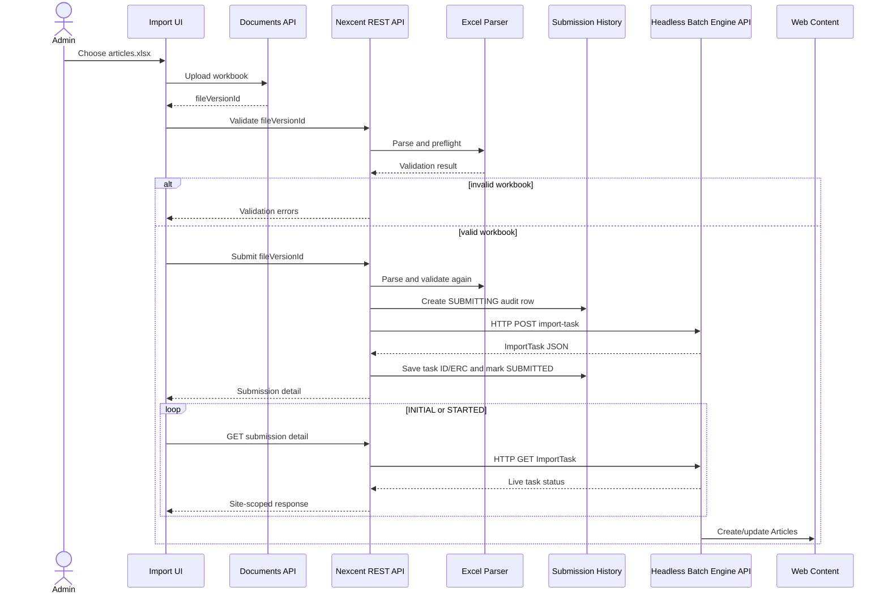

# Excel Web Content Importer — Detailed Design

Status: **REVIEWED / IMPLEMENTATION PENDING**  
Target: **Liferay DXP 2026.Q1.1 LTS**  
Branch: **`feat/excel-web-content-importer`**  
Scope: **assessment exercise, NXC Article only**

## 1. Goal

Build a small Site Administration tool that demonstrates this complete flow:

```text
Create Excel
→ upload Excel to Liferay
→ parse and validate in a custom backend module
→ transform rows to StructuredContent JSON
→ call the Headless Batch Engine REST API
→ track the returned ImportTask
→ show submission history
```

The assessment must prove a real HTTP API call to Liferay Batch Engine. Calling `BatchEngineImportTaskLocalService`, `BatchEngineImportTaskExecutor`, or another local Batch Engine service does **not** satisfy this requirement.

## 2. Scope

### In scope

- One fixed content type: `NXC Article`.
- One locale: `en-US`.
- One sheet: `Articles`.
- Images uploaded manually before Excel import.
- Images referenced by Documents and Media ERC.
- Apache POI parsing and read-only preflight validation.
- One Headless Batch Engine `ImportTask` per valid workbook.
- Tracking through the Headless Batch Engine API.
- Thin custom history linking the workbook version and Batch task.
- Re-import by Article ERC after runtime UPSERT support is proven.

### Out of scope

- Generic Structure-driven imports.
- Runtime image upload.
- ZIP packages or manifests.
- Multiple locales.
- Taxonomy and tags.
- Nested, repeatable, or fieldset fields.
- Custom queue, worker, retry engine, or per-row executor.
- Copying Batch status and failed items into custom tables.
- Deploying the classic Web Content Structure through a Batch Client Extension.

## 3. Terminology

This feature is not a Client Extension with `type: batch`.

A Batch Client Extension deploys source-controlled `*.batch-engine-data.json` files. The runtime Excel tool instead parses an uploaded workbook and calls the Headless Batch Engine REST API.

```text
Excel importer
→ custom REST API
→ Headless Batch Engine REST API
```

## 4. Content setup

### 4.1 Structure

| Property | Value |
|---|---|
| Name | `NXC Article` |
| Structure key | `NXC_ARTICLE` |
| Structure ERC | `NXC-STRUCTURE-ARTICLE` |
| Locale | `en-US` |

Fields:

| Field reference | Type | Required |
|---|---|---:|
| `summary` | Long Text | Yes |
| `body` | Rich Text | Yes |
| `coverImage` | Image | Yes |
| `coverImageAlt` | Text | Yes |
| `authorName` | Text | Yes |
| `featured` | Boolean | Yes |
| `sortOrder` | Number | Yes |

The exported Structure JSON is stored in:

```text
training/excel-web-content-importer/nxc-article-structure.json
```

On a fresh environment, import it manually through Web Content → Structures → Import Structure.

### 4.2 Images

Upload cover images to Documents and Media before importing Excel. Assign stable ERCs such as:

```text
NXC-DOC-ARTICLE-001-COVER
NXC-DOC-ARTICLE-002-COVER
```

Excel stores only:

```text
coverImageERC
coverImageAlt
```

Numeric Document IDs and local file paths are not accepted.

## 5. Excel contract

Workbook:

```text
Extension: .xlsx
Sheet: Articles
Maximum rows: 500
Maximum size: 10 MiB
```

Columns:

| Column | Required | Rule |
|---|---:|---|
| `externalReferenceCode` | Yes | Unique, `NXC-ARTICLE-*` |
| `title` | Yes | 1–255 characters |
| `friendlyUrlPath` | Yes | Lowercase URL segment |
| `summary` | Yes | 40–320 characters |
| `bodyHtml` | Yes | Safe HTML |
| `coverImageERC` | Yes | Existing Document ERC |
| `coverImageAlt` | Yes | Maximum 180 characters |
| `authorName` | Yes | Maximum 120 characters |
| `featured` | Yes | `true` or `false` |
| `sortOrder` | Yes | Integer `0..999999` |

Parser rules:

- Use Apache POI.
- Read the exact stored `FileVersion`.
- Reject `.xls`, formulas, macros, encrypted workbooks, and external links.
- Require the exact header set.
- Ignore fully empty rows.
- Reject duplicate Article ERCs and friendly URLs.
- Reject scripts, iframes, inline event handlers, and `javascript:` URLs.
- Reject the entire workbook if any preflight error exists.

## 6. Components

```text
nexcent-training-web
└── native Site Administration UI

nexcent-training-rest-impl
└── site-scoped import, tracking, and history endpoints

nexcent-training-excel-importer
├── ArticleExcelParser
├── ArticleRowValidator
├── ArticleStructureValidator
├── DocumentERCResolver
├── ArticleStructuredContentMapper
└── HeadlessBatchEngineClient

nexcent-training-service
└── ExcelImportSubmission audit entity
```

## 7. Responsibility boundary

### Custom importer

- Loads the exact workbook version.
- Parses Excel.
- Validates the workbook and Structure contract.
- Resolves Document ERCs.
- Builds a JSON array of `StructuredContent` payloads.
- Calls the Headless Batch Engine REST API.
- Stores the returned task reference.

### Headless Batch Engine

- Runs asynchronously.
- Creates or updates Web Content.
- Owns `executeStatus`.
- Owns processed and total counts.
- Owns failed item details and task errors.

The custom importer must not loop over rows to create Web Content directly.

## 8. Runtime flow



The submit endpoint parses and validates again. It must not trust a previous browser validation result.

## 9. Structured Content mapping

System fields:

| Excel/runtime source | StructuredContent field |
|---|---|
| Article ERC | `externalReferenceCode` |
| title | `title` |
| friendly URL | `friendlyUrlPath` |
| resolved Structure | `contentStructureId` |

Content fields:

| Excel/runtime source | Field reference |
|---|---|
| `summary` | `summary` |
| `bodyHtml` | `body` |
| resolved Document | `coverImage` |
| `coverImageAlt` | `coverImageAlt` |
| `authorName` | `authorName` |
| `featured` | `featured` |
| `sortOrder` | `sortOrder` |

`ContentFieldValue.data` is a string. Serialize boolean and numeric values as strings:

```json
{
  "name": "featured",
  "contentFieldValue": {
    "data": "true"
  }
}
```

The image field uses `ContentFieldValue.image` with a `ContentDocument`. The exact request fixture must come from a successful single-item request against the target runtime.

## 10. Required Batch API call

### 10.1 Submit

The backend calls the official Headless Batch Engine endpoint over HTTP:

```http
POST /o/headless-batch-engine/v1.0/import-task/{className}?siteId={siteId}
Content-Type: application/json
Authorization: Bearer {token}
```

Request body:

```json
[
  {
    "externalReferenceCode": "NXC-ARTICLE-001",
    "contentStructureId": 12345,
    "title": "Community Management Guide",
    "friendlyUrlPath": "community-management-guide",
    "contentFields": []
  }
]
```

The runtime `/o/api` schema is the source of truth for:

- `{className}` from `x-class-name`;
- supported query parameters;
- `createStrategy`;
- `importStrategy`;
- `taskItemDelegateName`;
- exact `StructuredContent` and image payloads.

Expected assessment settings, only after runtime verification:

```text
operation: CREATE
createStrategy: UPSERT
importStrategy: ON_ERROR_CONTINUE
siteId: current site ID
```

### 10.2 Track

The backend calls:

```http
GET /o/headless-batch-engine/v1.0/import-task/{importTaskId}
Authorization: Bearer {token}
```

The custom detail endpoint proxies only the authorized, site-scoped fields required by the UI.

### 10.3 Client implementation

Use an HTTP client or the generated `com.liferay.headless.batch.engine.client` library. The generated client is acceptable because it invokes the REST API.

Do not use:

```text
BatchEngineImportTaskLocalService
BatchEngineImportTaskExecutor
BatchEngineImportTaskErrorPersistence
```

for submission or tracking in this exercise.

### 10.4 Authentication

Use an OAuth2 headless server application with only the scopes required for Batch Engine and Web Content import. Store credentials in Liferay configuration or secrets, never in source code.

For local manual API Explorer verification, an administrator may use the current authenticated session. Basic authentication is not part of the final implementation.

Because the API call uses a technical OAuth identity, the imported content creator may be the technical user. `ExcelImportSubmission.userId` still records the administrator who initiated the import.

## 11. Submission history

Entity: `ExcelImportSubmission`

| Field | Purpose |
|---|---|
| `excelImportSubmissionId` | Internal ID |
| `groupId` | Site scope |
| `userId`, `userName` | Initiating user |
| `createDate` | Submission time |
| `fileEntryId` | Source file |
| `fileVersionId` | Exact workbook version |
| `fileName`, `fileVersion` | Display metadata |
| `sha256` | Workbook fingerprint |
| `structureERC` | `NXC-STRUCTURE-ARTICLE` |
| `submittedRowsCount` | Payload item count |
| `submissionStatus` | API submission state only |
| `submissionError` | API-call failure summary only |
| `batchImportTaskId` | Returned Batch task ID |
| `batchImportTaskERC` | Returned/stable task ERC |

Allowed `submissionStatus` values:

```text
SUBMITTING
SUBMITTED
SUBMIT_FAILED
```

This status describes only whether the HTTP API submission succeeded. It does not duplicate Batch execution status.

Batch-owned fields are never persisted:

```text
executeStatus
processedItemsCount
totalItemsCount
failedItems
errorMessage
startTime
endTime
```

## 12. API failure boundary

A remote HTTP call cannot share a database transaction with the Batch Engine task.

Use this sequence:

```text
1. Validate workbook
2. Create history row as SUBMITTING
3. Call Batch REST API
4. On success, save task ID/ERC and mark SUBMITTED
5. On HTTP failure, mark SUBMIT_FAILED
```

If the Batch API succeeds but saving the task ID fails, log the returned task ID and task ERC as an orphan-recovery event. A production system could add an outbox/reconciliation job, but that is outside this assessment.

## 13. Custom REST API

Base path:

```text
/o/nexcent-training/v1.0
```

### Validate

```http
POST /sites/{siteId}/article-excel-imports/validate
```

Request:

```json
{
  "fileVersionId": 48201
}
```

Returns row count, Structure readiness, resolved image count, and all validation errors. It creates no Batch task and no history row.

### Submit

```http
POST /sites/{siteId}/article-excel-imports
```

Request:

```json
{
  "fileVersionId": 48201
}
```

Success: `202 Accepted`

```json
{
  "id": 101,
  "fileVersionId": 48201,
  "submittedRowsCount": 5,
  "submissionStatus": "SUBMITTED",
  "batchImportTaskId": 5012,
  "batchImportTaskExternalReferenceCode": "NXC-EXCEL-IMPORT-550e8400-e29b-41d4-a716-446655440000",
  "executeStatus": "INITIAL",
  "processedItemsCount": 0,
  "totalItemsCount": 0
}
```

Batch `totalItemsCount` may still be zero while the task is `INITIAL`; the UI separately shows `submittedRowsCount`.

### Detail and tracking

```http
GET /sites/{siteId}/article-excel-imports/{submissionId}
```

The backend verifies permission and calls the Batch Engine GET API to enrich the response with live status.

### History

```http
GET /sites/{siteId}/article-excel-imports?page=1&pageSize=20
```

The list loads summary task fields only. Full failed items are loaded in detail.

## 14. UI

Location:

```text
Site Menu → Content & Data → Nexcent Excel Importer
```

Views:

```text
Import Articles
Import Detail
Import History
```

Import flow:

```text
Choose Excel
→ Validate Excel
→ review validation summary
→ Submit Batch Import
→ track ImportTask
```

The tracking UI polls the custom detail endpoint every two seconds during `INITIAL` and `STARTED`, and stops on `COMPLETED` or `FAILED`.

No retry-per-row, cancel, edit-in-grid, Structure selector, or image upload is required.

## 15. Security

- Require a dedicated site importer permission or site `UPDATE` permission.
- Verify the exact FileVersion belongs to the current site and restricted folder.
- Verify referenced Documents belong to the current site and are visible to the initiating user.
- Do not accept Structure IDs or Document IDs from workbook cells.
- Restrict OAuth2 scopes used by the Batch API client.
- Keep workbook files non-public.
- Do not expose another site's history or Batch task.
- Do not log workbook bytes or full body HTML.

## 16. Mandatory runtime spike

Before full implementation:

1. Import the Structure JSON.
2. Upload one image and assign its ERC.
3. Create one Article using the normal Structured Content POST API.
4. Capture the working image payload.
5. Read the `StructuredContent` `x-class-name` from `/o/api`.
6. Call the Batch Engine REST API with the same payload and `siteId`.
7. Confirm the response returns an ImportTask ID.
8. Poll the Batch Engine GET API until `COMPLETED` or `FAILED`.
9. Re-submit the same Article ERC with the verified UPSERT parameter.
10. Confirm update rather than duplication.

Check in these fixtures:

```text
training/excel-web-content-importer/runtime-contract/
├── structured-content-class-name.txt
├── single-article-request.json
├── batch-article-request.json
├── batch-submit-response.json
└── README.md
```

No full importer implementation starts until this spike passes.

## 17. Acceptance criteria

1. Structure JSON is source-controlled and imports successfully.
2. Images are uploaded before Excel and referenced by ERC.
3. Backend parses the exact FileVersion with Apache POI.
4. Invalid preflight creates no Batch task.
5. A valid workbook produces one HTTP POST to the Headless Batch Engine API.
6. The returned ImportTask ID is stored in history.
7. Tracking performs HTTP GET calls to the Headless Batch Engine API.
8. Batch Engine creates or updates the Web Content.
9. UI shows status, progress, and failed items.
10. Custom history does not duplicate Batch execution state.
11. No Batch Engine local service is used for submission or tracking.
12. No custom row executor, queue, or retry engine exists.

## 18. Implementation order

```text
0. Runtime API capability spike
1. Structure JSON, sample images, and workbook
2. OAuth2 Batch API client configuration
3. Thin ExcelImportSubmission entity
4. Exact FileVersion loader
5. Excel parser and validators
6. Document ERC resolver
7. StructuredContent mapper
8. Headless Batch Engine HTTP client
9. REST Builder validate/submit/detail/history endpoints
10. Native Liferay UI
11. Tests and runtime evidence
```

## 19. Official references

- Batch Engine API Basics — Importing Data: https://learn.liferay.com/w/dxp/integration/headless-apis/using-liferay-as-a-headless-platform/consuming-apis/batch-engine-api-basics-importing-data
- Batch Engine API Basics — Exporting Data: https://learn.liferay.com/w/dxp/integration/headless-apis/using-liferay-as-a-headless-platform/consuming-apis/batch-engine-api-basics-exporting-data
- Web Content API Basics: https://learn.liferay.com/w/dxp/integration/headless-apis/content-management-apis/web-content-apis/web-content-api-basics
- Managing Web Content Structures: https://learn.liferay.com/w/dxp/content-management-system/web-content/web-content-structures/managing-web-content-structures
