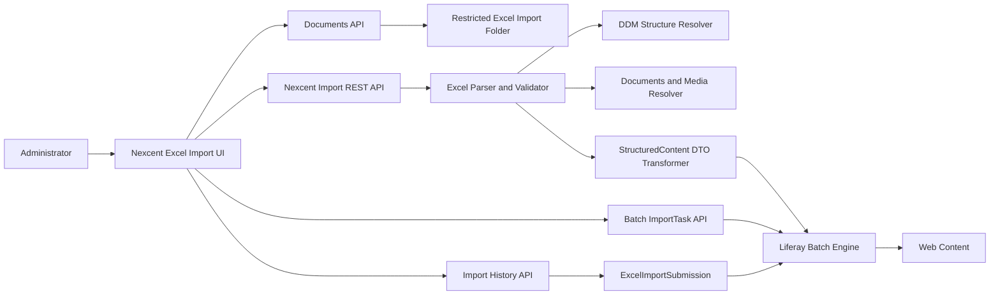
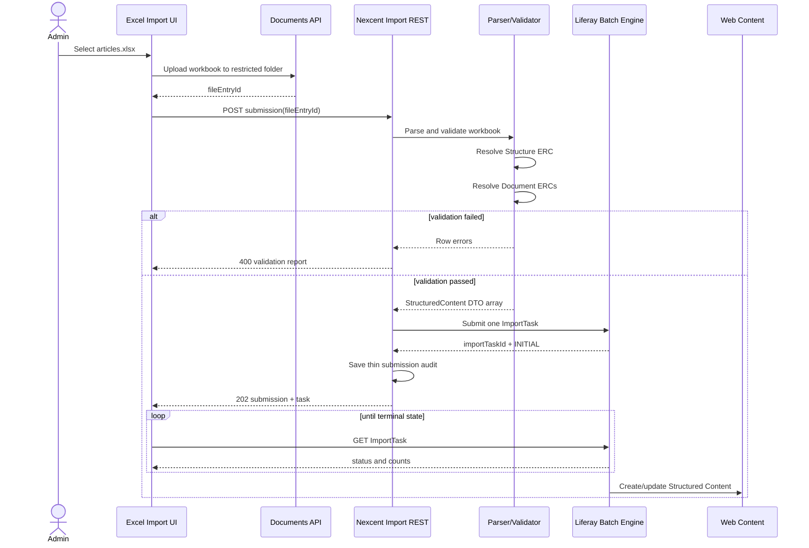

# Excel Web Content Importer — Detailed Design

Status: **DESIGN APPROVED / IMPLEMENTATION PENDING**  
Target runtime: **Liferay DXP 2026.Q1.1 LTS**  
Implementation branch: **`feat/excel-web-content-importer`**  
Scope: **assessment exercise, Article only**

## 1. Purpose

Build a small Liferay administration tool that imports `NXC Article` Web Content from Excel while proving these capabilities:

1. Upload an Excel workbook through Liferay.
2. Parse and validate workbook rows with Apache POI.
3. Resolve the target Web Content Structure by external reference code.
4. Resolve pre-uploaded Documents and Media images by external reference code.
5. Transform valid rows into `StructuredContent` DTO JSON.
6. Submit one Liferay Batch Engine `ImportTask` per workbook.
7. Track task status and progress using Liferay Batch Engine.
8. Show import history by linking the uploaded workbook to the Batch Engine task.

The feature must use Liferay as the source of truth. It must not implement a custom queue, worker, batch status engine, or per-row execution framework.

## 2. Scope

### 2.1 In scope

- One fixed content type: `NXC Article`.
- One Excel sheet: `Articles`.
- One source workbook per import submission.
- Images uploaded manually to Documents and Media before Excel import.
- Images referenced from Excel by Documents and Media ERC.
- Read-only preflight validation before Batch Engine submission.
- One Structured Content Batch Engine task per valid workbook.
- Batch task tracking: status, processed count, total count, failed items.
- Thin history record containing workbook and Batch Engine task references.
- Re-import by Article ERC using the runtime-supported UPSERT strategy.
- A sample workbook and operating guide.

### 2.2 Out of scope

- Uploading image binaries from the importer.
- ZIP packages or manifests.
- Generic content-type profiles.
- Multiple Web Content Structures.
- Taxonomy or category import.
- Archive/delete operations.
- Custom retry engine.
- Custom asynchronous worker or queue.
- Custom execution status machine.
- Persisting Batch Engine failed items in custom tables.
- Importing the Web Content Structure through a Batch Client Extension.

## 3. Key architecture decisions

### ADR-01 — Use classic Web Content Structured Content

`NXC Article` is a classic Liferay Web Content article backed by a Web Content Structure. The importer creates or updates `StructuredContent` items.

### ADR-02 — Structure definition is source-controlled but imported manually

The exported structure JSON is committed to source control:

```text
training/excel-web-content-importer/
└── nxc-article-structure.json
```

For a fresh environment, an administrator imports the JSON once through:

```text
Site Menu → Content & Data → Web Content → Structures → Options → Import Structure
```

The structure is not packaged in a Batch Client Extension because this exercise targets classic Web Content Structures and does not assume a Batch Engine delegate for structure creation.

### ADR-03 — Images are prepared before workbook import

Editors upload cover images to Documents and Media first and assign stable ERCs. Excel stores `coverImageERC`, never a numeric file ID or a local path.

### ADR-04 — Batch Engine owns execution state

The importer submits a single Liferay Batch Engine import task containing all valid Article DTOs. Liferay owns:

- asynchronous execution;
- task status;
- processed and total item counts;
- failed item details;
- task error message.

### ADR-05 — History is an audit link, not a second batch engine

A thin Service Builder entity links the uploaded Excel file to the Liferay Batch Engine task. Execution status is always read from Batch Engine.

## 4. System context



## 5. Deployment and environment setup

### 5.1 Source-controlled artifacts

```text
client-extensions/
└── nexcent-excel-importer/                 # frontend client extension or hosted UI

modules/nexcent-training/
├── nexcent-training-api/                   # submission service contract
├── nexcent-training-service/               # thin Service Builder history
├── nexcent-training-rest-api/              # REST Builder DTO/resource
├── nexcent-training-rest-impl/             # REST implementation
├── nexcent-training-excel-importer/         # parser, validator, transformer, batch gateway
└── nexcent-training-web/                    # Site Administration UI shell if retained

training/excel-web-content-importer/
├── nxc-article-structure.json
├── nxc-article-import-template.xlsx
└── README.md
```

The final implementation may host the React UI inside the existing Site Administration MVC portlet or as a frontend client extension. The backend contract remains the same.

### 5.2 Manual fresh-environment steps

1. Deploy workspace modules and client extensions.
2. Import `nxc-article-structure.json` manually.
3. Verify the structure ERC is `NXC-STRUCTURE-ARTICLE`.
4. Create the Documents and Media folder `NXC Article Assets`.
5. Upload Article cover images.
6. Assign stable Document ERCs such as `NXC-DOC-ARTICLE-001-COVER`.
7. Create the restricted folder `NXC Article Excel Imports`.
8. Configure permissions for the importer role.
9. Verify the `StructuredContent` Batch Engine class name using `/o/api` on the target runtime.
10. Import a sample workbook.

## 6. Content Structure contract

### 6.1 Identity

| Property | Value |
|---|---|
| Name | `NXC Article` |
| Structure key | `NXC_ARTICLE` |
| Structure ERC | `NXC-STRUCTURE-ARTICLE` |
| Default locale | `en-US` |

### 6.2 Fields

| Label | Field reference | Expected type | Required |
|---|---|---|---:|
| Summary | `summary` | Long Text | Yes |
| Body | `body` | Rich Text | Yes |
| Cover Image | `coverImage` | Image | Yes |
| Cover Image Alt | `coverImageAlt` | Text | Yes |
| Author Name | `authorName` | Text | Yes |
| Featured | `featured` | Boolean | Yes |
| Sort Order | `sortOrder` | Integer/Number | Yes |

The importer validates the runtime structure before reading executable rows. It resolves fields by field reference, not display label or array position.

### 6.3 Structure validation codes

```text
STRUCTURE_NOT_FOUND
STRUCTURE_FIELD_MISSING
STRUCTURE_FIELD_TYPE_MISMATCH
STRUCTURE_FIELD_REQUIRED_MISMATCH
UNSUPPORTED_REQUIRED_STRUCTURE_FIELD
```

A structure validation error blocks Batch Engine submission.

## 7. Documents and Media image contract

### 7.1 Preparation

Images are uploaded before Excel import using standard Documents and Media UI or API.

Example ERCs:

```text
NXC-DOC-ARTICLE-001-COVER
NXC-DOC-ARTICLE-002-COVER
NXC-DOC-ARTICLE-003-COVER
```

### 7.2 Excel reference

Excel stores:

```text
coverImageERC
coverImageAlt
```

The importer resolves the file by `(siteId, coverImageERC)` and maps the runtime file ID and scope information into the Structured Content image field.

### 7.3 Validation rules

- `coverImageERC` is required.
- The Document must exist.
- The Document must belong to the current site or an explicitly supported asset-library scope.
- The current user must be able to view the Document.
- `coverImageAlt` is required and limited to 180 characters.
- Numeric file IDs are rejected as workbook integration keys.

### 7.4 Error codes

```text
COVER_IMAGE_ERC_REQUIRED
COVER_IMAGE_NOT_FOUND
COVER_IMAGE_SCOPE_MISMATCH
COVER_IMAGE_PERMISSION_DENIED
COVER_IMAGE_ALT_REQUIRED
```

## 8. Excel workbook contract

### 8.1 Workbook

File type: `.xlsx` only.  
Sheet name: `Articles`.

### 8.2 Columns

| Column | Required | Rule |
|---|---:|---|
| `externalReferenceCode` | Yes | Stable; `NXC-ARTICLE-*` |
| `locale` | Yes | Enabled site locale; baseline `en-US` |
| `title` | Yes | 1–255 characters |
| `friendlyUrlPath` | Yes | Lowercase URL segment |
| `summary` | Yes | 40–320 characters |
| `bodyHtml` | Yes | Safe editorial HTML |
| `coverImageERC` | Yes | Existing Documents and Media ERC |
| `coverImageAlt` | Yes | Meaningful accessible description |
| `authorName` | Yes | 1–120 characters |
| `featured` | Yes | `true` or `false` |
| `sortOrder` | Yes | Integer `0..999999` |
| `publish` | No | Defaults to `false` |

### 8.3 Parser rules

- Use Apache POI.
- Reject `.xls`, formulas, macros, encrypted workbooks, and external links.
- Validate exact required headers.
- Ignore fully empty rows.
- Reject duplicate `(externalReferenceCode, locale)` rows.
- Reject duplicate friendly URL paths in the workbook.
- Parse booleans strictly.
- Reject fractional values for integer fields.
- Sanitize or reject unsafe HTML: scripts, iframes, inline event handlers, and `javascript:` URLs.
- Limit the assessment workbook to 500 Article rows and 10 MiB.

### 8.4 Row validation result

```json
{
  "rowNumber": 6,
  "field": "coverImageERC",
  "code": "COVER_IMAGE_NOT_FOUND",
  "message": "No document exists with ERC NXC-DOC-ARTICLE-006-COVER"
}
```

If any preflight error exists, the workbook is not submitted to Batch Engine.

## 9. Runtime workflow

### 9.1 Sequence



### 9.2 Processing steps

1. UI uploads the workbook to a restricted Documents and Media folder.
2. UI sends the returned `fileEntryId` to the custom REST endpoint.
3. Backend validates site scope, folder ERC, extension, file size, and permission.
4. Backend reads the workbook stream from Documents and Media.
5. Parser validates headers and row data.
6. Structure validator resolves `NXC-STRUCTURE-ARTICLE` and verifies its field contract.
7. Image resolver resolves all `coverImageERC` values.
8. Transformer creates one `StructuredContent` DTO per valid row.
9. Batch gateway serializes the DTO array as JSON.
10. Batch gateway creates one Liferay Batch Engine import task.
11. Backend stores the workbook/task association.
12. UI polls the standard Batch Engine ImportTask endpoint.
13. UI displays final Batch Engine failed items when present.

## 10. Structured Content DTO mapping

### 10.1 System fields

| Excel | StructuredContent |
|---|---|
| `externalReferenceCode` | `externalReferenceCode` |
| `title` | `title` |
| `friendlyUrlPath` | `friendlyUrlPath` |
| `publish` | workflow/status behavior supported by target API |
| runtime Structure | `contentStructureId` |

### 10.2 Content fields

| Excel/runtime value | Content field |
|---|---|
| `summary` | `summary` |
| `bodyHtml` | `body` |
| resolved Document | `coverImage` |
| `coverImageAlt` | `coverImageAlt` |
| `authorName` | `authorName` |
| `featured` | `featured` |
| `sortOrder` | `sortOrder` |

### 10.3 Example payload

The exact image object property names must be verified against the DXP 2026.Q1.1 `/o/api` schema. The expected logical payload is:

```json
[
  {
    "externalReferenceCode": "NXC-ARTICLE-001",
    "contentStructureId": 12345,
    "title": "Community Management Guide",
    "friendlyUrlPath": "community-management-guide",
    "contentFields": [
      {
        "name": "summary",
        "contentFieldValue": {
          "data": "A concise guide for community administrators."
        }
      },
      {
        "name": "body",
        "contentFieldValue": {
          "data": "<p>Article body</p>"
        }
      },
      {
        "name": "coverImage",
        "contentFieldValue": {
          "image": {
            "id": 38201,
            "externalReferenceCode": "NXC-DOC-ARTICLE-001-COVER",
            "scopeExternalReferenceCode": "NEXCENT-PUBLIC-WEBSITE"
          }
        }
      },
      {
        "name": "coverImageAlt",
        "contentFieldValue": {
          "data": "Community administrators collaborating"
        }
      },
      {
        "name": "authorName",
        "contentFieldValue": {
          "data": "Nexcent Editorial Team"
        }
      },
      {
        "name": "featured",
        "contentFieldValue": {
          "data": true
        }
      },
      {
        "name": "sortOrder",
        "contentFieldValue": {
          "data": 10
        }
      }
    ]
  }
]
```

## 11. Batch Engine integration

### 11.1 Batch class name

Resolve and verify the target entity class from the runtime `/o/api` schema using its `x-class-name` value. Do not copy an unverified class name from documentation or another DXP build.

The implementation may compile against the target `StructuredContent` DTO and use `StructuredContent.class.getName()` after runtime verification.

### 11.2 Submission properties

| Property | Value |
|---|---|
| Task ERC | `NXC-EXCEL-IMPORT-{timestamp-or-uuid}` |
| Content type | `JSON` |
| Operation | `CREATE` |
| Create strategy | `UPSERT` |
| Import strategy | `ON_ERROR_CONTINUE` |
| Scope parameter | `siteId={currentSiteId}` |
| Payload | JSON array of `StructuredContent` DTOs |

The runtime must confirm that `StructuredContent` supports `UPSERT`. If the delegate exposes a different supported strategy set, the implementation must use the runtime-supported equivalent and document the behavior.

### 11.3 Submission implementation

Inside the same Liferay JVM, use the OOTB Batch Engine services:

```text
BatchEngineImportTaskLocalService
BatchEngineImportTaskExecutor
```

The custom module is only a gateway that:

1. creates the Batch Engine task with the normalized JSON payload;
2. schedules execution after the transaction commits;
3. returns the Liferay task ID.

It does not iterate over Article rows to execute them.

### 11.4 Tracking

UI reads:

```text
GET /o/headless-batch-engine/v1.0/import-task/{importTaskId}
```

Required fields:

```text
id
externalReferenceCode
executeStatus
processedItemsCount
totalItemsCount
failedItems
errorMessage
startTime
endTime
```

Terminal statuses:

```text
COMPLETED
FAILED
```

UI must also tolerate intermediate statuses returned by the target runtime, including `INITIAL` and `STARTED`.

## 12. History persistence

### 12.1 Entity: `ExcelImportSubmission`

| Field | Type | Purpose |
|---|---|---|
| `excelImportSubmissionId` | long PK | Internal identity |
| `groupId` | long | Site scope |
| `companyId` | long | Company scope |
| `userId` | long | Submitted by |
| `userName` | String | History display |
| `createDate` | Date | Submission time |
| `fileEntryId` | long | Uploaded source workbook |
| `fileName` | String | Original workbook name |
| `structureERC` | String | `NXC-STRUCTURE-ARTICLE` |
| `batchImportTaskId` | long | Liferay Batch Engine task ID |
| `batchImportTaskERC` | String | Stable task reference |

Finders:

```text
G(groupId) ordered by createDate descending
G_T(groupId, batchImportTaskId) unique
```

### 12.2 Explicitly not persisted

Do not persist these Batch Engine-owned values in the custom entity:

```text
executeStatus
processedItemsCount
totalItemsCount
failedItems
errorMessage
startTime
endTime
```

The history API enriches each submission by reading its current Batch Engine task.

### 12.3 Validation failures

A workbook that fails preflight is not a submitted import and does not create `ExcelImportSubmission`. The UI displays the validation report immediately. This keeps the assessment history focused on actual Batch Engine submissions.

## 13. REST API design

Base path:

```text
/o/nexcent-training/v1.0
```

### 13.1 Create and submit import

```http
POST /sites/{siteId}/article-excel-imports
Content-Type: application/json
```

Request:

```json
{
  "fileEntryId": 38200
}
```

Success response: `202 Accepted`

```json
{
  "id": 101,
  "fileEntryId": 38200,
  "fileName": "articles.xlsx",
  "batchImportTaskId": 5012,
  "batchImportTaskExternalReferenceCode": "NXC-EXCEL-IMPORT-20260722-001",
  "status": "INITIAL",
  "processedItemsCount": 0,
  "totalItemsCount": 5
}
```

Validation failure: `400 Bad Request`

```json
{
  "code": "WORKBOOK_VALIDATION_FAILED",
  "errors": [
    {
      "rowNumber": 6,
      "field": "coverImageERC",
      "code": "COVER_IMAGE_NOT_FOUND",
      "message": "No document exists with ERC NXC-DOC-ARTICLE-006-COVER"
    }
  ]
}
```

### 13.2 Get submission detail

```http
GET /sites/{siteId}/article-excel-imports/{submissionId}
```

Returns submission audit plus live Batch Engine task status.

### 13.3 Get history

```http
GET /sites/{siteId}/article-excel-imports?page=1&pageSize=20
```

Returns paged submissions ordered newest first, enriched with current Batch Engine status.

### 13.4 Failed items

Use the standard Batch Engine task response or failed-item report endpoint. Do not copy failed items into a custom REST model unless only normalizing the OOTB response for UI display.

## 14. UI design

The application appears under:

```text
Site Menu → Content & Data → Nexcent Excel Importer
```

### 14.1 Import view

Components:

- Structure label: `NXC Article` read-only.
- File input accepting `.xlsx`.
- Import button.
- Required setup note: images must already exist in Documents and Media and Excel must contain Document ERCs.
- Validation result table.

### 14.2 Tracking view

```text
Workbook: articles.xlsx
Task: 5012
Status: STARTED
Progress: 3 / 5
Failed: 0
```

Polling behavior:

- poll every 2 seconds while non-terminal;
- stop polling on `COMPLETED` or `FAILED`;
- stop polling when the component unmounts;
- provide a manual Refresh action;
- display Batch Engine failed item index and message.

### 14.3 History view

Columns:

```text
Submitted date
Workbook
Submitted by
Batch task ID
Status
Progress
Action: View
```

No Retry action is required for the assessment. The user corrects the Excel file and creates a new submission.

## 15. Error handling

### 15.1 Preflight errors

Preflight errors block task creation and are reported with row and field context.

Groups:

```text
FILE
WORKBOOK
STRUCTURE
DOCUMENT
ROW
SECURITY
```

### 15.2 Batch execution errors

Batch Engine is the source of truth. UI displays:

- task-level `errorMessage`;
- failed item index;
- failed item payload summary when safe;
- failed item message.

### 15.3 Failure boundaries

- Invalid workbook: no history row, no Batch task.
- Failure while creating Batch task: no history row; return infrastructure error.
- Batch task fails after creation: history remains and displays Batch Engine `FAILED` status.
- History enrichment cannot read a task: display `TASK_UNAVAILABLE` without changing stored audit data.

## 16. Security and permissions

- Require site `UPDATE` permission or a dedicated `Nexcent Excel Importer` action.
- Verify the source workbook belongs to the current site.
- Verify the source workbook is in the restricted Excel import folder.
- Verify every referenced Document is visible to the current user.
- Do not trust `siteId`, file IDs, structure IDs, or Document IDs supplied from workbook cells.
- Reject formula cells and unsafe HTML.
- Keep uploaded Excel files non-public.
- Do not expose the full workbook or sensitive Batch Engine item payloads to unauthorized users.

## 17. Idempotency

### 17.1 Article identity

```text
(siteId, externalReferenceCode)
```

Excel uses stable Article ERCs. Re-import must update the existing Article rather than create duplicates when the target Batch Engine delegate supports UPSERT.

### 17.2 Submission identity

Each Import button action creates a new task ERC and a new history record. The same workbook may therefore produce multiple submissions, while the Article ERC preserves content idempotency.

### 17.3 Image identity

Images are identified by Document ERC. Re-import reuses the existing Document; the importer does not version or mutate the image.

## 18. Observability

Log only task-level technical information:

```text
submissionId
siteId
fileEntryId
batchImportTaskId
batchImportTaskERC
rowCount
duration of preflight
```

Do not log full body HTML or workbook binary data.

Recommended log events:

```text
ARTICLE_EXCEL_IMPORT_VALIDATION_STARTED
ARTICLE_EXCEL_IMPORT_VALIDATION_FAILED
ARTICLE_EXCEL_IMPORT_BATCH_SUBMITTED
ARTICLE_EXCEL_IMPORT_TASK_LOOKUP_FAILED
```

## 19. Test design

### 19.1 Unit tests

- Exact header validation.
- Required field validation.
- Strict boolean parsing.
- Fractional integer rejection.
- Formula cell rejection.
- Duplicate ERC/locale rejection.
- Unsafe HTML rejection.
- Structure contract validation.
- Missing Document ERC validation.
- DTO transformation.
- Batch task parameter construction.

### 19.2 Integration tests

- Resolve Structure by ERC.
- Resolve Document by ERC in current site.
- Submit one Batch Engine task for multiple rows.
- Read task progress and failed items.
- Save and list `ExcelImportSubmission` history.
- Re-import the same Article ERC without creating a duplicate.

### 19.3 Runtime QA

1. Import the Structure JSON on a fresh site.
2. Upload three cover images and assign ERCs.
3. Import a valid three-row workbook.
4. Confirm one Batch Engine task is created.
5. Confirm three Web Content Articles exist under `NXC Article`.
6. Confirm cover images render in Web Content preview/detail.
7. Import a workbook with one missing Document ERC and confirm no task is created.
8. Import a workbook with one execution-level invalid item and confirm Batch Engine failed item tracking.
9. Re-import a corrected workbook and confirm Article ERCs are updated, not duplicated.
10. Confirm history shows each submitted workbook and its live Batch task status.

## 20. Acceptance criteria

The assessment passes when all conditions are met:

1. `NXC Article` Structure JSON is stored in source control and can be imported manually on a fresh environment.
2. Images are uploaded before import and referenced from Excel by Document ERC.
3. The UI uploads one `.xlsx` file through Liferay.
4. The backend parses Excel using Apache POI.
5. Preflight validates Structure fields, required row values, and Document ERC references.
6. A valid workbook creates exactly one Liferay Batch Engine ImportTask.
7. The Batch Engine task creates or updates all valid Web Content Articles.
8. The UI displays task status, processed count, total count, and failed items.
9. History links the source Excel file to its Batch Engine task.
10. Custom persistence does not duplicate Batch Engine status or failed item data.
11. Re-importing the same Article ERC does not create duplicate Articles when UPSERT is supported by the runtime.
12. No custom queue, retry engine, or per-row executor exists.

## 21. Implementation order

```text
1. Add exported NXC Article Structure JSON and sample workbook
2. Add thin ExcelImportSubmission Service Builder entity
3. Implement workbook parser and row validation
4. Implement runtime Structure contract validation
5. Implement Documents and Media ERC resolver
6. Implement StructuredContent DTO transformer
7. Implement Batch Engine gateway
8. Implement REST Builder endpoints
9. Implement import, tracking, and history UI
10. Add tests and fresh-runtime QA guide
```

## 22. Official references

- Batch Engine API Basics — Importing Data: https://learn.liferay.com/w/dxp/integration/headless-apis/using-liferay-as-a-headless-platform/consuming-apis/batch-engine-api-basics-importing-data
- Batch Engine API Basics — Exporting Data and `x-class-name`: https://learn.liferay.com/w/dxp/integration/headless-apis/using-liferay-as-a-headless-platform/consuming-apis/batch-engine-api-basics-exporting-data
- Web Content API Basics: https://learn.liferay.com/w/dxp/integration/headless-apis/content-management-apis/web-content-apis/web-content-api-basics
- Managing Web Content Structures: https://learn.liferay.com/w/dxp/content-management-system/web-content/web-content-structures/managing-web-content-structures
- Web Content Structures with Data Engine: https://learn.liferay.com/w/dxp/content-management-system/web-content/web-content-structures/web-content-structures-with-data-engine
- Packaging Client Extensions: https://learn.liferay.com/w/dxp/development/client-extensions/packaging-client-extensions
