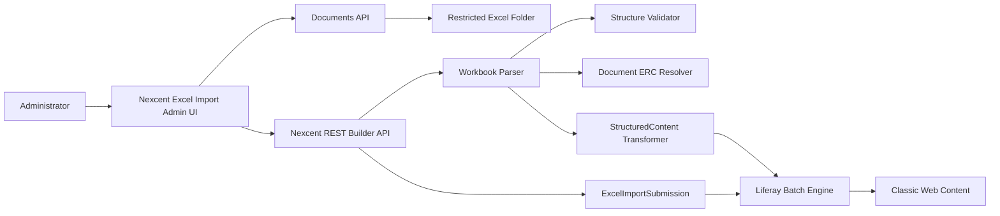
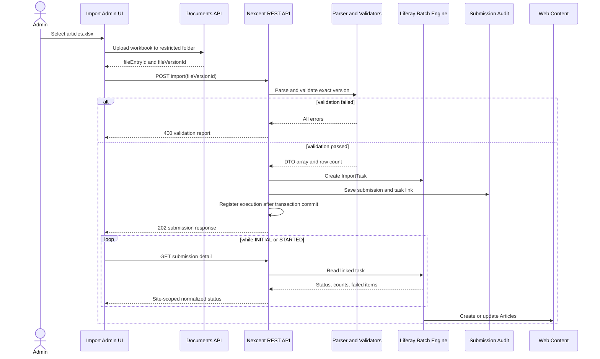

# Excel Web Content Importer — Detailed Design

Status: **REVIEWED / IMPLEMENTATION PENDING**  
Target runtime: **Liferay DXP 2026.Q1.1 LTS**  
Implementation branch: **`feat/excel-web-content-importer`**  
Scope: **assessment exercise, Article only**

## 1. Purpose

Build a small Liferay administration tool that imports `NXC Article` Web Content from Excel and proves these capabilities:

1. Upload an Excel workbook through Liferay.
2. Parse and validate workbook rows with Apache POI.
3. Resolve a classic Web Content Structure by external reference code (ERC).
4. Resolve pre-uploaded Documents and Media images by ERC.
5. Transform valid rows into `StructuredContent` batch JSON.
6. Submit exactly one Liferay Batch Engine `ImportTask` per valid workbook.
7. Track task status, progress, and failed items.
8. Show submission history by linking the exact workbook version to its Batch Engine task.

The feature must not implement a custom queue, worker, batch status machine, retry engine, or per-row executor.

## 2. Terminology

This runtime tool is **not** a Liferay Client Extension with `type: batch`.

A Batch Client Extension deploys source-controlled `*.batch-engine-data.json` payloads from a LUFFA. It does not accept an arbitrary Excel upload at runtime.

This design uses:

```text
Excel Import UI
→ custom REST Builder API
→ Apache POI preflight
→ Liferay Batch Engine ImportTask
→ classic Web Content StructuredContent
```

The word **batch** in this document means the Liferay Batch Engine runtime API.

## 3. Scope

### 3.1 In scope

- One fixed content type: `NXC Article`.
- One sheet: `Articles`.
- One locale for the assessment: `en-US`.
- One source workbook per submission.
- Images uploaded manually before Excel import.
- Images referenced by Documents and Media ERC.
- Read-only preflight validation before Batch submission.
- One `StructuredContent` Batch Engine task per valid workbook.
- Live task tracking from Batch Engine.
- Thin submission history linking the workbook version and Batch task.
- Re-import by Article ERC using runtime-verified UPSERT support.
- Sample Structure JSON, workbook, images, and operating guide.

### 3.2 Out of scope

- Runtime image binary upload.
- ZIP packages and manifests.
- Multiple locales or translations.
- A generic content-type/profile framework.
- Multiple Web Content Structures.
- Taxonomy, categories, and tags.
- Scheduling, archive, and delete operations.
- A workbook `publish` option.
- Custom retry, queue, worker, or status engine.
- Persisting Batch Engine failed items in custom tables.
- Deploying the classic Web Content Structure through a Batch Client Extension.

## 4. Architecture decisions

### ADR-01 — Use classic Web Content

`NXC Article` is a classic Liferay Web Content article backed by a Web Content Structure and represented by the Headless Delivery `StructuredContent` DTO.

### ADR-02 — Import the Structure JSON manually

The exported Structure JSON is source-controlled:

```text
training/excel-web-content-importer/
└── nxc-article-structure.json
```

For a fresh environment, import it once through:

```text
Site Menu
→ Content & Data
→ Web Content
→ Structures
→ Options
→ Import Structure
```

The assessment Structure contains no fieldsets. If fieldsets are added later, import them before the Structure.

### ADR-03 — Upload images before Excel

Editors upload cover images to Documents and Media and assign stable ERCs. Excel stores only `coverImageERC` and `coverImageAlt`.

### ADR-04 — Batch Engine owns execution

Liferay Batch Engine owns:

- asynchronous execution;
- `executeStatus`;
- processed and total item counts;
- failed item details;
- task error message;
- start and end timestamps.

### ADR-05 — Custom history is audit metadata only

A thin `ExcelImportSubmission` entity links the exact workbook version to the Batch Engine task. It does not duplicate Batch status or failed items.

### ADR-06 — UI tracks through the custom site-scoped API

The UI does not call the company-scoped Batch Engine API directly during normal use. It polls the custom submission detail endpoint, which:

1. verifies site permission and ownership of the submission;
2. loads the linked Batch task server-side;
3. returns a normalized site-scoped response.

The standard Batch Engine endpoint remains useful for API Explorer and runtime QA.

## 5. System context



## 6. Deployment artifacts

```text
modules/nexcent-training/
├── nexcent-training-api/
├── nexcent-training-service/              # thin submission history
├── nexcent-training-rest-api/
├── nexcent-training-rest-impl/
├── nexcent-training-excel-importer/        # parser, validators, transformer, batch gateway
└── nexcent-training-web/                   # Site Administration UI

training/excel-web-content-importer/
├── nxc-article-structure.json
├── nxc-article-import-template.xlsx
├── sample-images/
└── README.md
```

For this assessment, use the native Site Administration MVC portlet in `nexcent-training-web`. Do not implement both an MVC portlet and a Custom Element UI.

## 7. Fresh-environment setup

1. Deploy workspace modules.
2. Import `nxc-article-structure.json`.
3. Verify Structure key `NXC_ARTICLE` and ERC `NXC-STRUCTURE-ARTICLE`.
4. Create Documents and Media folder:

```text
Name: NXC Article Assets
ERC:  NXC-FOLDER-ARTICLE-ASSETS
```

5. Upload sample cover images and assign Document ERCs.
6. Create restricted workbook folder:

```text
Name: NXC Article Excel Imports
ERC:  NXC-FOLDER-ARTICLE-EXCEL-IMPORTS
```

7. Configure importer role permissions.
8. Inspect `/o/api` and record the runtime `StructuredContent` `x-class-name`.
9. Run the runtime capability spike in section 18 before implementing the complete flow.

## 8. Content Structure contract

### 8.1 Identity

| Property | Value |
|---|---|
| Name | `NXC Article` |
| Structure key | `NXC_ARTICLE` |
| Structure ERC | `NXC-STRUCTURE-ARTICLE` |
| Default locale | `en-US` |

### 8.2 Fields

| Label | Field reference | Logical type | Required |
|---|---|---|---:|
| Summary | `summary` | Long Text | Yes |
| Body | `body` | Rich Text | Yes |
| Cover Image | `coverImage` | Image | Yes |
| Cover Image Alt | `coverImageAlt` | Text | Yes |
| Author Name | `authorName` | Text | Yes |
| Featured | `featured` | Boolean | Yes |
| Sort Order | `sortOrder` | Integer/Number | Yes |

The exported Structure JSON from the target runtime is the exact schema artifact. The validator resolves fields by **field reference**, not label or array position.

Runtime DDM field type strings can differ from UI labels. The implementation must define a small normalized mapping based on the exported DXP 2026.Q1.1 JSON rather than compare directly with labels such as `Long Text` or `Rich Text`.

### 8.3 Structure validation codes

```text
STRUCTURE_NOT_FOUND
STRUCTURE_FIELD_MISSING
STRUCTURE_FIELD_TYPE_MISMATCH
STRUCTURE_FIELD_REQUIRED_MISMATCH
UNSUPPORTED_REQUIRED_STRUCTURE_FIELD
```

Any Structure contract error blocks Batch task creation.

## 9. Image contract

### 9.1 Preparation

Images are uploaded before Excel import using standard Documents and Media UI or API.

Example ERCs:

```text
NXC-DOC-ARTICLE-001-COVER
NXC-DOC-ARTICLE-002-COVER
NXC-DOC-ARTICLE-003-COVER
```

### 9.2 Excel reference

```text
coverImageERC
coverImageAlt
```

The importer resolves the file by site and Document ERC, then maps its runtime ID and scope ERC into the image `ContentDocument`.

### 9.3 Validation rules

- `coverImageERC` is required.
- The Document must exist.
- The Document must belong to the current site for the assessment.
- The current user must be able to view the Document.
- `coverImageAlt` is required and at most 180 characters.
- Numeric file IDs are not accepted as workbook integration keys.
- Asset Library scope is deferred; it is not part of the assessment.

### 9.4 Error codes

```text
COVER_IMAGE_ERC_REQUIRED
COVER_IMAGE_NOT_FOUND
COVER_IMAGE_SCOPE_MISMATCH
COVER_IMAGE_PERMISSION_DENIED
COVER_IMAGE_ALT_REQUIRED
```

## 10. Excel contract

### 10.1 Workbook

```text
File:  .xlsx only
Sheet: Articles
Rows:  maximum 500
Size:  maximum 10 MiB
Locale: en-US only
```

### 10.2 Columns

| Column | Required | Rule |
|---|---:|---|
| `externalReferenceCode` | Yes | Stable; `NXC-ARTICLE-*` |
| `title` | Yes | 1–255 characters |
| `friendlyUrlPath` | Yes | Lowercase URL path segment |
| `summary` | Yes | 40–320 characters |
| `bodyHtml` | Yes | Safe editorial HTML |
| `coverImageERC` | Yes | Existing Document ERC in current site |
| `coverImageAlt` | Yes | Accessible description |
| `authorName` | Yes | 1–120 characters |
| `featured` | Yes | Strict `true` or `false` |
| `sortOrder` | Yes | Integer `0..999999` |

There is no `locale` or `publish` column in the assessment workbook.

### 10.3 Parser rules

- Use Apache POI.
- Reject `.xls`, formula cells, macros, encrypted workbooks, and external links.
- Validate the exact header set.
- Ignore fully empty rows.
- Reject duplicate Article ERCs in the workbook.
- Reject duplicate friendly URL paths.
- Parse booleans strictly.
- Reject fractional integer values.
- Reject scripts, iframes, inline event handlers, and `javascript:` URLs.
- Read the workbook through the exact stored `FileVersion`, not the mutable latest `FileEntry` stream.

### 10.4 Validation behavior

Preflight is all-or-nothing:

```text
Any preflight error
→ no Batch task
→ no ExcelImportSubmission history row
→ return complete validation report
```

Example:

```json
{
  "rowNumber": 6,
  "field": "coverImageERC",
  "code": "COVER_IMAGE_NOT_FOUND",
  "message": "No document exists with ERC NXC-DOC-ARTICLE-006-COVER"
}
```

The uploaded invalid workbook remains in the restricted folder and can be removed manually during lab cleanup.

## 11. Runtime sequence



## 12. DTO mapping

### 12.1 System fields

| Source | `StructuredContent` |
|---|---|
| Article ERC | `externalReferenceCode` |
| title | `title` |
| friendly URL | `friendlyUrlPath` |
| resolved Structure | `contentStructureId` |

Publication/workflow behavior is not exposed as an Excel option. The runtime capability spike must record the actual status produced by the target Batch delegate.

### 12.2 Content fields

| Source | Field reference |
|---|---|
| summary | `summary` |
| bodyHtml | `body` |
| resolved Document | `coverImage` |
| coverImageAlt | `coverImageAlt` |
| authorName | `authorName` |
| featured | `featured` |
| sortOrder | `sortOrder` |

### 12.3 Data type rule

`ContentFieldValue.data` is a string in the Headless Delivery DTO. Therefore boolean and numeric fields are serialized as string values:

```json
{
  "name": "featured",
  "contentFieldValue": {
    "data": "true"
  }
}
```

```json
{
  "name": "sortOrder",
  "contentFieldValue": {
    "data": "10"
  }
}
```

### 12.4 Logical payload example

The final payload must be copied from a successful single-item request in the target runtime API Explorer before batch submission is implemented.

```json
[
  {
    "externalReferenceCode": "NXC-ARTICLE-001",
    "contentStructureId": 12345,
    "title": "Community Management Guide",
    "friendlyUrlPath": "community-management-guide",
    "contentFields": [
      {
        "name": "summary",
        "contentFieldValue": {
          "data": "A concise guide for community administrators."
        }
      },
      {
        "name": "body",
        "contentFieldValue": {
          "data": "<p>Article body</p>"
        }
      },
      {
        "name": "coverImage",
        "contentFieldValue": {
          "image": {
            "id": 38201,
            "externalReferenceCode": "NXC-DOC-ARTICLE-001-COVER",
            "scopeExternalReferenceCode": "NEXCENT-PUBLIC-WEBSITE"
          }
        }
      },
      {
        "name": "coverImageAlt",
        "contentFieldValue": {
          "data": "Community administrators collaborating"
        }
      },
      {
        "name": "authorName",
        "contentFieldValue": {
          "data": "Nexcent Editorial Team"
        }
      },
      {
        "name": "featured",
        "contentFieldValue": {
          "data": "true"
        }
      },
      {
        "name": "sortOrder",
        "contentFieldValue": {
          "data": "10"
        }
      }
    ]
  }
]
```

## 13. Batch Engine integration

### 13.1 Runtime class name

Inspect `/o/api`, find the `StructuredContent` schema, and record its `x-class-name`. The expected class can be compiled through `StructuredContent.class.getName()`, but runtime verification is still a release gate.

### 13.2 Task parameters

| Property | Value |
|---|---|
| Task ERC | `NXC-EXCEL-IMPORT-{UUID}` |
| Content type | `JSON` |
| Operation | `CREATE` |
| Create strategy | `UPSERT`, only after runtime confirmation |
| Import strategy | `ON_ERROR_CONTINUE` |
| Task item delegate | `DEFAULT`, unless `/o/api` proves otherwise |
| Scope | `siteId={currentSiteId}` |
| Payload | JSON array of Article DTOs |

### 13.3 Service implementation

Inside the same JVM, use OOTB Batch Engine services:

```text
BatchEngineImportTaskLocalService
BatchEngineImportTaskExecutor
```

Create the Batch task and `ExcelImportSubmission` in the same transaction. Register the executor callback only after the transaction commits.

Required atomic behavior:

```text
Task creation fails
→ rollback submission

Submission save fails
→ rollback task

Transaction commits
→ start Batch execution
```

No custom row loop is allowed.

### 13.4 Execute statuses

Supported statuses for the target API are:

```text
INITIAL
STARTED
COMPLETED
FAILED
```

Terminal statuses are `COMPLETED` and `FAILED`.

## 14. Submission history

### 14.1 Entity: `ExcelImportSubmission`

| Field | Type | Purpose |
|---|---|---|
| `excelImportSubmissionId` | long PK | Internal identity |
| `groupId` | long | Site scope |
| `companyId` | long | Company scope |
| `userId` | long | Submitted by |
| `userName` | String | History display |
| `createDate` | Date | Submission time |
| `fileEntryId` | long | Source file identity |
| `fileVersionId` | long | Exact imported workbook version |
| `fileName` | String | Original file name |
| `fileVersion` | String | Human-readable D&M version |
| `sha256` | String | Exact source fingerprint |
| `structureERC` | String | `NXC-STRUCTURE-ARTICLE` |
| `submittedRowsCount` | int | Rows serialized into the Batch payload |
| `batchImportTaskId` | long | Liferay Batch task ID |
| `batchImportTaskERC` | String | Stable task reference |

Finders:

```text
G(groupId), newest first
G_T(groupId, batchImportTaskId), unique
```

### 14.2 Not persisted

```text
executeStatus
processedItemsCount
totalItemsCount
failedItems
errorMessage
startTime
endTime
```

These values are always read from Batch Engine.

## 15. REST API

Base path:

```text
/o/nexcent-training/v1.0
```

### 15.1 Submit workbook

```http
POST /sites/{siteId}/article-excel-imports
Content-Type: application/json
```

Request:

```json
{
  "fileVersionId": 48201
}
```

Success: `202 Accepted`

```json
{
  "id": 101,
  "fileEntryId": 38200,
  "fileVersionId": 48201,
  "fileName": "articles.xlsx",
  "submittedRowsCount": 5,
  "batchImportTaskId": 5012,
  "batchImportTaskExternalReferenceCode": "NXC-EXCEL-IMPORT-550e8400-e29b-41d4-a716-446655440000",
  "status": "INITIAL",
  "processedItemsCount": 0,
  "totalItemsCount": 0
}
```

`submittedRowsCount` is known from preflight. Batch Engine `totalItemsCount` may still be zero while the task is `INITIAL`.

Validation failure: `400 Bad Request`

```json
{
  "code": "WORKBOOK_VALIDATION_FAILED",
  "errors": [
    {
      "rowNumber": 6,
      "field": "coverImageERC",
      "code": "COVER_IMAGE_NOT_FOUND",
      "message": "No document exists with ERC NXC-DOC-ARTICLE-006-COVER"
    }
  ]
}
```

### 15.2 Submission detail and tracking

```http
GET /sites/{siteId}/article-excel-imports/{submissionId}
```

Returns audit metadata enriched with live Batch task fields:

```text
status
processedItemsCount
totalItemsCount
failedItems
errorMessage
startTime
endTime
```

### 15.3 History

```http
GET /sites/{siteId}/article-excel-imports?page=1&pageSize=20
```

Returns newest submissions first. For list performance, enrich only task summary fields. Load full `failedItems` only in the detail endpoint.

## 16. UI design

Application location:

```text
Site Menu → Content & Data → Nexcent Excel Importer
```

### 16.1 Import view

- Read-only target: `NXC Article`.
- `.xlsx` file input.
- Setup note explaining Document ERCs.
- Import button.
- Complete preflight error table.

### 16.2 Tracking view

```text
Workbook: articles.xlsx
Submitted rows: 5
Task: 5012
Status: STARTED
Batch progress: 3 / 5
Failed: 0
```

Polling:

- every 2 seconds during `INITIAL` or `STARTED`;
- stop on `COMPLETED` or `FAILED`;
- cancel polling on unmount;
- provide manual Refresh;
- poll the custom site-scoped detail endpoint.

### 16.3 History view

```text
Submitted date
Workbook and version
Submitted by
Submitted rows
Batch task ID
Status
Progress
View
```

No Retry action is required. Correct the workbook and create a new submission.

## 17. Security

- Require site `UPDATE` permission or a dedicated importer action.
- Verify the exact FileVersion belongs to the current site.
- Verify its FileEntry is in folder ERC `NXC-FOLDER-ARTICLE-EXCEL-IMPORTS`.
- Verify all Documents are in the current site and visible to the submitting user.
- Execute the Batch task as the submitting user.
- Do not accept site ID, Structure ID, Document ID, or FileEntry ID from workbook cells.
- Keep Excel files non-public.
- Do not expose another site's submission or Batch task.
- Do not log workbook bytes or full body HTML.

## 18. Mandatory runtime capability spike

Before full implementation, perform these checks on DXP 2026.Q1.1:

1. Import the Structure JSON.
2. Upload one cover image and assign a Document ERC.
3. Use `/o/api` to capture:
   - `StructuredContent` `x-class-name`;
   - POST request schema;
   - image field schema;
   - available Batch create strategies.
4. Create one Article through the normal Headless Delivery POST endpoint.
5. Confirm the exact image payload works.
6. Record the resulting Web Content workflow/publication status.
7. Submit the same payload through Batch Engine with `siteId`.
8. Confirm the task reaches `COMPLETED`.
9. Submit the same Article ERC again with `UPSERT`.
10. Confirm it updates rather than duplicates.

The spike produces a checked-in fixture:

```text
training/excel-web-content-importer/runtime-contract/
├── structured-content-class-name.txt
├── single-article-request.json
├── batch-article-request.json
└── README.md
```

Do not implement the full importer until this gate passes.

## 19. Failure boundaries

```text
Invalid workbook
→ no Batch task
→ no history row

Batch task creation or history save fails
→ transaction rollback

Batch task fails after commit
→ history remains
→ status comes from Batch Engine

Batch task cannot be read
→ return TASK_UNAVAILABLE
→ do not mutate audit data
```

## 20. Tests

### Unit

- Exact headers.
- Required fields.
- Strict boolean parsing.
- Fractional integer rejection.
- Formula rejection.
- Duplicate Article ERC rejection.
- Duplicate friendly URL rejection.
- Unsafe HTML rejection.
- Structure contract normalization.
- Missing Document ERC.
- DTO string serialization for boolean and number fields.
- Batch parameter construction.

### Integration

- Resolve Structure by ERC.
- Resolve Document by ERC in current site.
- Read exact FileVersion.
- Create Batch task and audit record atomically.
- Start execution only after commit.
- Submit one task for multiple rows.
- Read live status through the custom detail endpoint.
- Re-import the same Article ERC without duplication.

### Runtime QA

1. Import Structure JSON on a fresh site.
2. Upload three images and assign ERCs.
3. Import a valid three-row workbook.
4. Confirm exactly one Batch task.
5. Confirm three Web Content Articles.
6. Confirm cover images render.
7. Import a workbook with a missing Document ERC and confirm no task/history row.
8. Trigger one execution-level failure and confirm failed item tracking.
9. Re-import corrected content and confirm ERC-based update.
10. Confirm history shows workbook version and live task status.

## 21. Acceptance criteria

1. Structure JSON is source-controlled and imports successfully.
2. Images are uploaded first and referenced by Document ERC.
3. UI uploads one `.xlsx` file through Liferay.
4. Backend parses the exact FileVersion with Apache POI.
5. Preflight validates Structure, rows, and Documents.
6. A valid workbook creates exactly one Liferay Batch Engine task.
7. Batch Engine, not custom code, executes Article creation/update.
8. UI displays live status, counts, and failed items through a site-scoped API.
9. History links the exact workbook version and hash to the Batch task.
10. Batch status and failures are not duplicated in custom persistence.
11. Re-import by ERC updates rather than duplicates after UPSERT capability is proven.
12. No custom queue, retry engine, status machine, or per-row executor exists.

## 22. Implementation order

```text
0. Run and check in the runtime capability spike
1. Add Structure JSON, workbook, images, and guide
2. Add thin ExcelImportSubmission entity
3. Implement exact FileVersion loading
4. Implement parser and preflight validation
5. Implement Structure contract validator
6. Implement Document ERC resolver
7. Implement StructuredContent transformer
8. Implement atomic Batch gateway and history save
9. Implement REST Builder endpoints
10. Implement import, tracking, and history UI
11. Add tests and fresh-runtime QA evidence
```

## 23. Official references

- Batch Engine API Basics — Importing Data: https://learn.liferay.com/w/dxp/integration/headless-apis/using-liferay-as-a-headless-platform/consuming-apis/batch-engine-api-basics-importing-data
- Batch Engine API Basics — Exporting Data: https://learn.liferay.com/w/dxp/integration/headless-apis/using-liferay-as-a-headless-platform/consuming-apis/batch-engine-api-basics-exporting-data
- Web Content API Basics: https://learn.liferay.com/w/dxp/integration/headless-apis/content-management-apis/web-content-apis/web-content-api-basics
- Managing Web Content Structures: https://learn.liferay.com/w/dxp/content-management-system/web-content/web-content-structures/managing-web-content-structures
- Web Content Structures with Data Engine: https://learn.liferay.com/w/dxp/content-management-system/web-content/web-content-structures/web-content-structures-with-data-engine
- Packaging Client Extensions: https://learn.liferay.com/w/dxp/development/client-extensions/packaging-client-extensions
